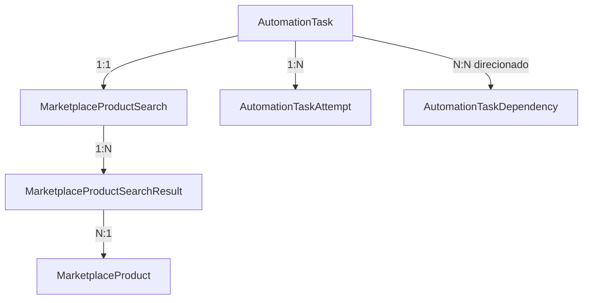

# Rastreabilidade de Automation Tasks e Resultados de Dominio

## Problem Statement

O backend usa `AutomationTask` como registro generico do ciclo de vida de operacoes assincronas executadas pelo BullMQ. Hoje, o resultado final fica concentrado no campo `result` do tipo `Json`, enquanto os produtos encontrados por uma busca sao associados a um `searchId` sem foreign key para uma entidade de busca ou para a task que iniciou a execucao.

Essa modelagem permite acompanhar status e contadores basicos, mas nao garante integridade referencial entre uma task de busca, a busca executada e os produtos encontrados. Para responder quais produtos foram gerados por uma task, a aplicacao precisa recuperar um `searchId` dentro de JSON e compara-lo manualmente com `MarketplaceProductSearchResult`. O banco nao consegue validar essa ligacao, navegar por ela como relacao Prisma ou impedir resultados orfaos.

O campo `attempts` registra apenas uma contagem. Erros, timestamps e metadados de tentativas anteriores sao sobrescritos pela tentativa seguinte. Tambem nao existe uma representacao persistente para tarefas que originam ou dependem de outras tarefas, embora o fluxo de produto possa evoluir de busca para captura de link afiliado, geracao de conteudo e publicacao.

A plataforma precisa separar claramente:

- o ciclo de vida generico de uma automacao;
- cada tentativa de execucao;
- os resultados de dominio produzidos por cada tipo de task;
- metadados tecnicos e diagnosticos;
- as dependencias entre tasks de um mesmo fluxo.

Essa separacao deve preservar a simplicidade de consulta por `taskId`, continuar compativel com processamento assincrono e retries do BullMQ, e permitir que novos tipos de automacao sejam adicionados sem transformar `AutomationTask` em uma tabela com dezenas de colunas opcionais.

## Solution

Manter `AutomationTask` como a entidade generica que representa uma unidade de trabalho assincrona e seu estado atual. Os resultados de negocio passam a ser persistidos em modelos especificos por tipo de automacao, ligados por foreign key a `AutomationTask`.

Para busca de produtos, introduzir `MarketplaceProductSearch` como entidade da execucao de busca. Ela deve guardar a task de origem, os parametros da busca e seus contadores finais. `MarketplaceProductSearchResult` passa a referenciar essa entidade por uma foreign key `searchId`, preservando a associacao entre a busca e o produto canonico em `MarketplaceProduct`.

O relacionamento principal sera:

O JSON generico deixa de ser a fonte oficial de resultados de dominio. Ele permanece apenas como metadado tecnico opcional, adequado para informacoes nao relacionais, diagnosticos, versoes de providers, payloads resumidos e dados que nao precisam de integridade ou consulta estruturada.

Cada processamento ou retry deve criar um `AutomationTaskAttempt`, preservando numero da tentativa, identificador do job BullMQ, status, erro, tipo de erro, timestamps e metadados tecnicos daquela execucao. `AutomationTask` continua expondo o estado agregado mais recente e um contador para consultas rapidas.

Dependencias entre tasks devem ser representadas por `AutomationTaskDependency`, com uma task predecessora e uma task sucessora. Uma sucessora somente pode ser liberada quando todas as predecessoras obrigatorias atingirem um estado aceito. Esse modelo suporta cadeias lineares e fluxos em que uma task depende de mais de um resultado anterior.

Para os demais tipos de automacao, adotar o mesmo padrao de resultado especifico ligado 1:1 a `AutomationTask`, criando os modelos conforme cada fluxo for implementado: captura de HTML, captura de link afiliado, geracao de conteudo e publicacao.

## User Stories

1. Como operador da plataforma, quero consultar uma task de busca e ver os produtos encontrados, para que eu nao precise correlacionar identificadores manualmente.
2. Como operador da plataforma, quero abrir um resultado de busca e identificar sua task de origem, para que eu possa investigar como ele foi produzido.
3. Como desenvolvedor, quero que a relacao entre task, busca e resultados seja garantida por foreign keys, para que registros orfaos nao sejam criados.
4. Como desenvolvedor, quero representar uma busca como entidade de dominio, para que seus parametros e resultados nao dependam de um payload temporario do BullMQ.
5. Como desenvolvedor, quero preservar `query`, `category`, `marketplace` e limite solicitado, para que uma busca possa ser auditada depois de concluida.
6. Como operador da plataforma, quero ver quantos produtos foram encontrados e quantos foram associados pela primeira vez, para que eu entenda o resultado da execucao.
7. Como analista, quero consultar todas as buscas que encontraram determinado produto, para que eu possa entender sua recorrencia.
8. Como analista, quero consultar os produtos de uma busca por ordem de descoberta, para que eu possa reproduzir a visao apresentada pelo provider quando essa informacao estiver disponivel.
9. Como desenvolvedor, quero manter um produto canonico separado de sua descoberta em uma busca, para que o mesmo produto nao seja duplicado entre execucoes.
10. Como desenvolvedor, quero armazenar um snapshot opcional dos dados descobertos, para que mudancas posteriores no produto canonico nao apaguem completamente o contexto historico da busca.
11. Como operador da plataforma, quero consultar todas as tentativas de uma task, para que eu veja o historico completo de retries.
12. Como operador da plataforma, quero ver o erro de cada tentativa, para que uma tentativa bem-sucedida posterior nao esconda falhas anteriores.
13. Como desenvolvedor, quero correlacionar uma tentativa com o job do BullMQ, para que logs operacionais e dados persistidos possam ser investigados em conjunto.
14. Como desenvolvedor, quero que cada tentativa tenha timestamps independentes, para que duracao, espera e repeticoes possam ser medidas corretamente.
15. Como operador da plataforma, quero distinguir falhas recuperaveis de bloqueios que exigem acao manual, para que eu saiba quando intervir.
16. Como desenvolvedor, quero manter o estado atual resumido na task, para que consultas comuns nao precisem agregar todo o historico de tentativas.
17. Como desenvolvedor, quero manter metadados tecnicos flexiveis em JSON, para que detalhes especificos de providers possam evoluir sem migracoes frequentes.
18. Como desenvolvedor, quero manter resultados de dominio fora do JSON generico, para que sejam tipados, indexados e protegidos por integridade referencial.
19. Como consumidor da API, quero consultar uma task por `taskId` e receber um resumo coerente do resultado especifico, para que o contrato continue simples.
20. Como consumidor da API, quero que tarefas antigas continuem consultaveis durante a migracao, para que a evolucao do schema nao quebre historicos existentes.
21. Como desenvolvedor, quero armazenar o resultado de captura de link afiliado em uma entidade propria, para que produto, URL original e URL afiliada possam ser consultados relacionalmente.
22. Como desenvolvedor, quero armazenar o resultado de captura de HTML em uma entidade propria, para que URL de origem, localizacao do artefato, checksum e tamanho possam ser auditados.
23. Como desenvolvedor, quero armazenar o resultado de geracao de conteudo em uma entidade propria, para que o conteudo e a task que o criou tenham uma relacao explicita.
24. Como desenvolvedor, quero armazenar o resultado de publicacao em uma entidade propria, para que identificador externo, URL publicada e conteudo de origem sejam rastreaveis.
25. Como operador da plataforma, quero navegar de uma busca para as tasks de captura de link que ela originou, para que eu acompanhe o pipeline do produto.
26. Como operador da plataforma, quero navegar de uma publicacao para todas as tasks anteriores das quais ela dependeu, para que eu possa reconstruir sua origem.
27. Como orquestrador, quero registrar que uma task depende de outra, para que uma tarefa sucessora nao comece antes de seus insumos estarem prontos.
28. Como orquestrador, quero permitir que uma task dependa de varias predecessoras, para que fluxos nao lineares sejam representados sem campos especiais.
29. Como orquestrador, quero consultar dependencias ainda nao concluidas, para que eu decida se uma task pode ser liberada para processamento.
30. Como desenvolvedor, quero impedir dependencias duplicadas e autorreferencias, para que o grafo de tasks permaneca valido.
31. Como desenvolvedor, quero detectar ou impedir ciclos entre tasks, para que o workflow nao fique permanentemente bloqueado.
32. Como operador da plataforma, quero identificar por que uma task esta bloqueada, para que eu saiba quais predecessoras ainda precisam terminar.
33. Como operador da plataforma, quero reprocessar uma task sem duplicar resultados de busca, para que retries sejam idempotentes.
34. Como desenvolvedor, quero persistir resultados e finalizar a task de forma consistente, para que uma task nao apareca como concluida antes de seus dados estarem salvos.
35. Como desenvolvedor, quero definir politicas de exclusao explicitas, para que a remocao de uma task ou produto nao apague historico de forma inesperada.
36. Como mantenedor, quero adicionar um novo tipo de automacao com uma tabela de resultado isolada, para que o modelo generico de tasks nao precise receber colunas especificas.
37. Como mantenedor, quero testar cada modulo de resultado por sua interface publica, para que refatoracoes internas nao quebrem testes sem alterar comportamento.
38. Como mantenedor, quero migrar os `searchId` existentes quando a correlacao puder ser comprovada, para que o historico atual seja preservado.
39. Como mantenedor, quero identificar resultados legados que nao possam ser ligados com seguranca a uma task, para que a migracao nao invente associacoes incorretas.
40. Como responsavel por suporte, quero consultar task, tentativas, dependencias e resultado de dominio em uma unica visao, para que diagnosticos exijam menos consultas manuais.

## Implementation Decisions

- `AutomationTask` continuara sendo a raiz generica do ciclo de vida de uma unidade de trabalho assincrona.
- Campos comuns permanecerao em `AutomationTask`: tipo, status atual, erro atual, tipo do erro atual, contador de tentativas, timestamps e metadados tecnicos opcionais.
- O campo JSON generico sera tratado como metadado tecnico e nao como fonte da verdade para resultados de dominio. A nomenclatura preferencial sera `resultMetadata` ou `metadata`.
- A compatibilidade do contrato publico atual sera preservada durante a migracao. O campo de resposta `result` podera ser montado a partir da entidade especifica, enquanto o armazenamento deixa de depender do JSON legado.
- Sera criado o modelo `MarketplaceProductSearch`, com relacao 1:1 obrigatoria com uma `AutomationTask` do tipo `marketplace_product_search`.
- `MarketplaceProductSearch` armazenara os parametros da busca, os contadores finais, timestamps relevantes e a relacao com os resultados encontrados.
- `MarketplaceProductSearchResult.searchId` continuara existindo semanticamente, mas passara a ser uma foreign key para `MarketplaceProductSearch.id`.
- `MarketplaceProductSearchResult` continuara sendo uma associacao explicita entre busca e produto, pois possui metadados proprios como data e ordem de descoberta e pode receber snapshot do item encontrado.
- `MarketplaceProduct` permanecera como registro canonico e deduplicado pela combinacao de marketplace e URL original.
- A exclusao de um `MarketplaceProduct` com resultados historicos sera restrita. Exclusao em cascata do produto para resultados nao sera usada, evitando perda silenciosa do historico.
- A exclusao de uma busca podera remover seus registros de associacao, mas a exclusao fisica de tasks historicas nao sera o fluxo operacional padrao.
- Sera criado um modulo de persistencia de buscas com uma interface pequena para criar a busca, salvar resultados idempotentemente, concluir contadores e consultar por task.
- A criacao da `AutomationTask` e de `MarketplaceProductSearch` devera ocorrer na mesma transacao de banco, antes da publicacao do job.
- O payload do job usara `taskId` e `searchId` persistidos. O worker nao gerara identidades de dominio durante o processamento.
- A persistencia dos produtos, das associacoes e dos contadores da busca ocorrera transacionalmente antes de a task ser marcada como concluida.
- O indice unico entre busca e produto sera preservado para garantir idempotencia em retries.
- Sera criado `AutomationTaskAttempt` para registrar cada consumo efetivo do job, incluindo numero da tentativa, identificador do job BullMQ, estado, erro, tipo de erro, timestamps e metadados tecnicos.
- `AutomationTask.attempts` ou `attemptCount` sera mantido como resumo para leitura rapida, derivado ou atualizado junto com a criacao da tentativa.
- O estado da tentativa e o estado agregado da task terao responsabilidades distintas: a tentativa descreve uma execucao; a task descreve o resultado atual da unidade de trabalho.
- O processamento devera encerrar a tentativa corrente ao concluir, falhar ou exigir acao manual, sem sobrescrever tentativas anteriores.
- Sera criado `AutomationTaskDependency` como relacao dirigida entre uma task predecessora e uma task sucessora.
- A tabela de dependencias suportara multiplas predecessoras e multiplas sucessoras, em vez de limitar o fluxo a um unico `parentTaskId`.
- Dependencias duplicadas e autorreferencias serao rejeitadas. Ciclos deverao ser impedidos pela camada de aplicacao antes da gravacao.
- O significado inicial da dependencia sera obrigatorio: a sucessora so pode ser liberada quando todas as predecessoras estiverem `completed` ou em outro estado explicitamente aceito pelo fluxo.
- A dependencia persistida representa rastreabilidade e pre-condicao. O mecanismo de orquestracao que cria ou libera jobs consumira essa informacao, mas continuara separado dos processors de dominio.
- Resultados de captura de link afiliado serao persistidos em uma entidade especifica ligada 1:1 a task e relacionada ao produto quando aplicavel.
- Resultados de captura de HTML armazenarao metadados do artefato; HTML grande devera ficar em armazenamento de objetos, e nao diretamente no registro da task.
- Resultados de geracao de conteudo e publicacao terao entidades especificas quando esses fluxos forem implementados, mantendo relacoes com seus insumos e artefatos de dominio.
- Nao sera criada uma unica tabela polimorfica de resultados com colunas opcionais para todos os tipos de automacao.
- O banco nao consegue garantir nativamente que o tipo da task corresponde ao modelo especifico ligado a ela. Essa invariavel sera validada pelos services de aplicacao e coberta por testes.
- As consultas Prisma deverao permitir navegar da task para seu resultado especifico e do resultado para a task sem leitura ou filtro por JSON.
- A migracao sera aditiva primeiro: criar novas tabelas e foreign keys, preencher dados correlacionaveis, mudar escrita e leitura, e somente depois remover ou renomear o uso legado de `result`.
- Registros legados sem correlacao comprovavel nao serao associados por heuristica. Eles permanecerao identificados como legado ate uma decisao explicita de retencao ou descarte.
- A falha entre a transacao no PostgreSQL e a publicacao no Redis continuara sendo tratada como risco conhecido. Uma estrategia outbox e entrega exatamente uma vez nao faz parte desta entrega.

## Testing Decisions

- Os testes verificarao comportamento observavel, invariantes de dominio e contratos dos repositories e services, sem depender da estrutura interna dos metodos.
- O modulo de busca sera testado para criacao atomica da task e da entidade de busca, publicacao do job com identificadores persistidos e retorno dos identificadores ao cliente.
- O repository de produtos sera testado para upsert do produto canonico, associacao por foreign key, idempotencia de retry, atualizacao de contadores e rollback em falha.
- As consultas serao testadas nos dois sentidos: produtos por task e task por resultado de busca.
- O service de automation tasks sera testado para criar e encerrar tentativas sem perder o historico anterior.
- Sera testado que timeout ou erro interno encerra a tentativa atual, atualiza o resumo da task e permite que o BullMQ execute nova tentativa.
- Sera testado que bloqueios manuais encerram a tentativa e nao sao tratados como retry automatico.
- O modulo de dependencias sera testado para criacao, consulta de predecessoras pendentes, multiplas dependencias, duplicidade, autorreferencia e deteccao de ciclos.
- Sera testado que uma task sucessora nao e liberada enquanto existir uma dependencia obrigatoria incompleta.
- Sera testado que os services rejeitam a criacao de um resultado especifico para um tipo incompativel de task.
- Sera testada a compatibilidade da resposta publica de consulta da task durante a transicao do JSON para resultados relacionais.
- A migracao sera validada com cenarios de busca existente correlacionavel, resultado legado sem task comprovavel e reexecucao idempotente apos o backfill.
- Os testes unitarios atuais de `AutomationTasksService`, dos processors e do repository Prisma de produtos servirao como referencia de estilo.
- Testes de repository com Prisma ou banco de teste serao priorizados para foreign keys, constraints, transacoes e a migracao, pois mocks isolados nao validam essas garantias do banco.
- O conjunto minimo de verificacao incluira formatacao e validacao do schema Prisma, geracao do client, testes direcionados, suite completa, lint e build.

## Out of Scope

- Implementar uma engine completa de workflows ou substituir o BullMQ.
- Garantir atomicidade distribuida entre PostgreSQL e Redis nesta entrega.
- Implementar outbox, inbox ou entrega exatamente uma vez.
- Criar uma interface visual para desenhar workflows.
- Implementar todos os fluxos futuros de geracao de conteudo e publicacao; esta entrega define o padrao de persistencia e os pontos de extensao.
- Armazenar documentos HTML grandes diretamente em `AutomationTask` ou em seu JSON de metadados.
- Criar versionamento completo de todos os campos do produto canonico. O snapshot da descoberta sera opcional e limitado ao necessario para auditoria.
- Excluir automaticamente dados historicos de tasks, tentativas ou resultados.
- Inferir associacoes entre tasks e resultados legados quando nao houver evidencia confiavel.
- Alterar a estrategia de selecao dos providers de marketplace.
- Alterar as politicas globais de retry e backoff do BullMQ, exceto pelo registro correto de cada tentativa.

## Further Notes

- A identidade da task e a identidade da busca possuem significados diferentes. `taskId` identifica a unidade de trabalho assincrona; `searchId` identifica a execucao de busca no dominio. Manter ambas permite que a modelagem evolua sem acoplar todos os resultados diretamente ao mecanismo de automacao.
- O resultado relacional deve ser a fonte da verdade. Um resumo pode continuar sendo apresentado como `result` na API, mas deve ser projetado a partir das tabelas especificas ou armazenado apenas como cache descartavel.
- O historico exato de preco, titulo e outros atributos exige snapshot em `MarketplaceProductSearchResult`. Sem snapshot, consultas antigas exibirao os valores atuais de `MarketplaceProduct`, que e atualizado por upsert.
- A tabela explicita de dependencias foi escolhida porque o roadmap inclui tarefas que podem depender de mais de um insumo. Caso o produto permaneca estritamente linear, ela ainda representa uma cadeia simples sem limitar evolucoes futuras.
- A primeira entrega deve priorizar a busca de produtos, pois ela ja possui resultados relacionais e expoe o problema atual. Captura de link afiliado pode ser migrada em seguida usando o mesmo padrao.
- A documentacao tecnica do modulo devera ser atualizada quando a migracao for implementada, substituindo o diagrama baseado em correlacao indireta por `searchId` pela nova navegacao relacional.
