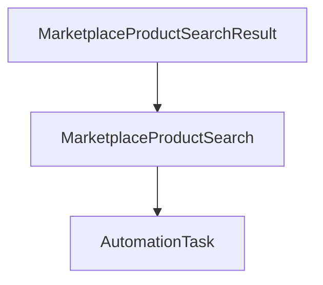

## Parent

`docs/automation-task-results-traceability/prd.md`

## What to build

Expor `GET /marketplace-search-results/:resultId/task` para navegar de uma descoberta especifica ate a busca e a `AutomationTask` que a produziram, usando somente relacoes persistidas e sem correlacionar identificadores por JSON.

## Acceptance criteria

- [x] O endpoint retorna o identificador do resultado, a busca relacionada e o resumo da task de origem.
- [x] A consulta navega pelas foreign keys `result -> search -> task` em uma unica operacao de repository.
- [x] Resultado inexistente retorna HTTP 404 e resultado legado sem busca relacional retorna resposta de conflito ou ausencia documentada, sem inferencia.
- [x] O contrato usa DTO de resposta e nao expoe modelos Prisma diretamente.
- [x] Testes de controller e repository cobrem resultado relacional, resultado legado e recurso inexistente.
- [x] A secao `Result` documenta o comportamento entregue, Diagrama Mermaid graph TD caso aplicavel, os principais arquivos ou contratos, Responsabilidade de cada arquivo, explicações sobre conceitos (caso aplicavel e necessario), decisoes e limites relevantes e as validacoes executadas.

## Blocked by

- `docs/automation-task-results-traceability/tickets/008-consultar-busca-e-produtos-descobertos.md`

## Result

Foi entregue `GET /marketplace-search-results/:resultId/task`. A resposta apresenta o resultado, os parametros resumidos da busca e tipo, status e timestamps da task de origem, usando DTOs publicos.

O repository percorre `result -> search -> task` com um unico `findUnique` e `select` aninhado. O service traduz resultado inexistente em HTTP 404 e resultado legado sem `searchId` relacional em HTTP 409, sem consultar JSON ou inferir correlacoes.

Arquivos principais: modulo `marketplaces/search-results`, DTO de resposta e registro no `MarketplacesModule`.

Validacoes: testes Supertest, service e repository cobrindo relacional, legado e inexistente; suite completa, lint e build NestJS.
