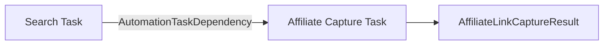

## Parent

`docs/automation-task-results-traceability/prd.md`

## What to build

Registrar explicitamente a dependencia entre a task de busca e cada task de captura de link afiliado criada a partir dela, e expor `GET /marketplace-searches/:searchId/affiliate-link-capture-tasks`. A navegacao deve usar o grafo persistido de tasks e o resultado relacional de captura, sem inferir origem apenas pelo produto.

## Acceptance criteria

- [x] Ao criar uma captura originada por uma busca, a dependencia dirigida entre as tasks e persistida antes da liberacao do job sucessor.
- [x] O endpoint retorna as tasks de captura originadas pela busca com status, produto, URLs e timestamps relevantes.
- [x] Capturas do mesmo produto sem dependencia com a busca nao aparecem no resultado.
- [x] A listagem e paginada, evita N+1 e retorna HTTP 404 para busca inexistente.
- [x] Testes cobrem criacao da dependencia, multiplas capturas, exclusao de falsos positivos e contrato HTTP.
- [x] A secao `Result` documenta o comportamento entregue, Diagrama Mermaid caso aplicavel, os principais arquivos ou contratos, Responsabilidade de cada arquivo, explicações sobre conceitos (caso aplicavel e necessario), decisoes e limites relevantes e as validacoes executadas.

## Blocked by

- `docs/automation-task-results-traceability/tickets/007-expor-navegacao-das-dependencias-de-uma-task.md`
- `docs/automation-task-results-traceability/tickets/008-consultar-busca-e-produtos-descobertos.md`

## Result

`POST /affiliate-link-capture` agora aceita `searchId` opcional. Quando informado, o service valida a busca antes de criar a task, persiste a dependencia `search task -> capture task` e somente depois publica o job BullMQ. Capturas sem origem de busca continuam usando o contrato anterior.

Foi entregue `GET /marketplace-searches/:searchId/affiliate-link-capture-tasks`, paginado e ordenado pela dependencia mais recente. A resposta inclui status da task, produto e URLs quando o resultado da captura ja existe, alem dos timestamps da task e da captura. Tasks pendentes ou em processamento permanecem visiveis com campos de resultado nulos.

O repository filtra pelo arco persistido e pelo tipo da task sucessora. Assim, capturas do mesmo produto sem dependencia com a busca nao aparecem e nenhuma origem e inferida pelo produto. A consulta usa `count` e `findMany` com `select` aninhado, evitando N+1.

Arquivos principais: DTO e service de `affiliate-link-capture`, exports dos modulos envolvidos, controller/service/repository de buscas e DTO da listagem.

Validacoes: testes de criacao, ordem antes da fila, multiplas capturas, tasks incompletas, filtro do grafo, paginacao e HTTP; suite completa, lint e build NestJS.
