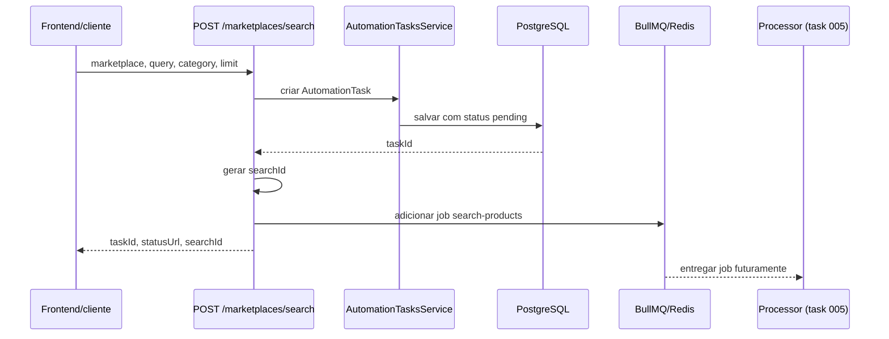

## Epic

[Marketplace Module](../epic.md)

## Parent

Referencia ao plano de marketplaces em `Docs/v2/marktplaces-modules.md`.

## What to build

Configurar BullMQ/Redis no backend e alterar a busca de marketplaces para criar uma `AutomationTask`, enfileirar um job `search-products` e retornar imediatamente os identificadores da task.

## Acceptance criteria

- [x] O app configura BullMQ com host/porta vindos de ambiente e defaults seguros de retry/backoff.
- [x] `MarketplacesModule` registra a fila `marketplace-product-search`.
- [x] `POST /marketplaces/search` nao executa provider diretamente no fluxo HTTP.
- [x] A resposta contem `taskId`, `statusUrl` e `searchId`.
- [x] O job enfileirado contem `taskId`, `searchId`, `marketplace`, `query`, `category` e `limit`.
- [x] Ha testes garantindo que a request cria task e adiciona job na fila.

## Result

O fluxo de busca deixou de executar o provider durante a requisicao HTTP. Agora
o endpoint cria uma `AutomationTask`, publica um job no BullMQ e responde sem
esperar a busca de produtos terminar.

## Como o fluxo funciona



Neste desenho, cada componente tem uma responsabilidade:

- `AutomationTask`: registro persistente usado pela aplicacao para acompanhar o
  estado da operacao.
- `Job`: mensagem com os dados necessarios para executar uma busca.
- `BullMQ`: gerencia a fila, tentativas e entrega dos jobs.
- `Redis`: armazena os dados operacionais do BullMQ.
- `Processor`: consumidor que executara a busca em segundo plano na task 005.

## Configuracao do BullMQ

Foram adicionadas as dependencias `@nestjs/bullmq`, `bullmq` e
`@nestjs/config`.

O `AppModule` registra globalmente o `ConfigModule` e configura o BullMQ por
meio de `BullModule.forRootAsync()`. A conexao usa:

| Variavel     | Default     | Finalidade               |
| ------------ | ----------- | ------------------------ |
| `REDIS_HOST` | `localhost` | Host da instancia Redis  |
| `REDIS_PORT` | `6379`      | Porta da instancia Redis |

Uma porta ausente ou invalida usa `6379`. As opcoes padrao de todos os jobs sao:

| Opcao              | Valor         | Comportamento                               |
| ------------------ | ------------- | ------------------------------------------- |
| `attempts`         | `3`           | Permite ate tres tentativas de execucao     |
| `backoff.type`     | `exponential` | Aumenta o intervalo entre novas tentativas  |
| `backoff.delay`    | `5000` ms     | Intervalo base do backoff                   |
| `removeOnComplete` | `100`         | Mantem os 100 jobs concluidos mais recentes |
| `removeOnFail`     | `500`         | Mantem os 500 jobs com falha mais recentes  |

> [!note]
> As tentativas e o backoff sao aplicados quando um processor consome e falha
> ao executar o job. Eles nao repetem automaticamente uma chamada a
> `queue.add()` que falhe antes de o job entrar no Redis.

## Fila e contrato do job

O `MarketplacesModule` importa `AutomationTasksModule` e registra a fila:

```text
marketplace-product-search
```

Os nomes da fila, do job e o tipo do payload ficam centralizados em
`lead-magnet-back/src/modules/marketplaces/jobs/marketplace-product-search.job.ts`.
Isso evita que producer e processor usem strings ou formatos diferentes.

O job publicado possui o nome `search-products` e o seguinte contrato:

```ts
type MarketplaceProductSearchJobData = {
  taskId: string;
  searchId: string;
  marketplace: Marketplace;
  query?: string;
  category?: string;
  limit: number;
};
```

- `taskId` relaciona o job com a `AutomationTask` persistida.
- `searchId` identifica esta execucao de busca e prepara o relacionamento com
  os produtos que serao persistidos em tasks futuras.
- Os demais campos representam os filtros recebidos pelo endpoint.

## Comportamento do endpoint

`POST /marketplaces/search` continua validando a entrada por meio de
`SearchMarketplaceProductsDto`, incluindo `limit` entre 1 e 100 e default 10.

Exemplo de request:

```json
{
  "marketplace": "amazon",
  "query": "leitor digital",
  "category": "eletronicos",
  "limit": 10
}
```

O `MarketplacesService` executa apenas a orquestracao inicial:

1. Cria uma `AutomationTask` do tipo `marketplace_product_search`.
2. Gera um UUID para `searchId`.
3. Adiciona o job `search-products` na fila.
4. Retorna os identificadores ao cliente.

Exemplo de resposta HTTP `201`:

```json
{
  "taskId": "550e8400-e29b-41d4-a716-446655440000",
  "statusUrl": "/automation-tasks/550e8400-e29b-41d4-a716-446655440000",
  "searchId": "75442486-0878-4d55-8e1e-5f50620ee80f"
}
```

O cliente pode consultar `statusUrl` para acompanhar a task. Neste ponto ela
permanece `pending`, pois o processamento ainda nao faz parte desta entrega.

## Arquivos principais

- `lead-magnet-back/src/app.module.ts`: conexao global e opcoes padrao do
  BullMQ.
- `lead-magnet-back/src/modules/marketplaces/marketplaces.module.ts`: registro
  da fila no feature module.
- `lead-magnet-back/src/modules/marketplaces/marketplaces.service.ts`: criacao
  da task, geracao do `searchId` e publicacao do job.
- `lead-magnet-back/src/modules/marketplaces/jobs/marketplace-product-search.job.ts`:
  constantes e contrato tipado do job.
- `lead-magnet-back/src/modules/marketplaces/dto/search-marketplace-products-response.dto.ts`:
  contrato e documentacao Swagger da resposta assincrona.
- `lead-magnet-back/src/modules/marketplaces/marketplaces.service.spec.ts`: teste
  da criacao da task e do payload enviado para a fila.
- `lead-magnet-back/src/modules/marketplaces/marketplaces.controller.spec.ts`:
  testes do contrato HTTP e da validacao de entrada.

## Limites desta task

O arquivo `marketplace-product-search.processor.ts` permanece vazio de
proposito. Consumir o job, selecionar o provider e atualizar a task para
`processing`, `completed`, `failed` ou `manual_required` pertencem a
[task 005](005-processar-busca-de-produtos-em-worker.md).

> [!warning] Falha ao publicar o job
> Atualmente a `AutomationTask` e criada antes de `queue.add()`. Se o Redis
> rejeitar a publicacao, a requisicao falha, mas a task pode permanecer
> `pending` sem um job correspondente. Uma compensacao para marcar essa task
> como `failed` deve ser adicionada antes de considerar o fluxo resiliente a
> indisponibilidade do Redis.

## Validacao

- `pnpm test --runInBand` passou com 25 testes.
- `pnpm build` passou.
- `pnpm lint` passou.

## Blocked by

- `docs/marketplace-module/tasks/001-definir-contrato-e-providers-fake-de-busca-de-produtos.md`
- `docs/marketplace-module/tasks/003-criar-persistencia-e-status-de-automation-task.md`
