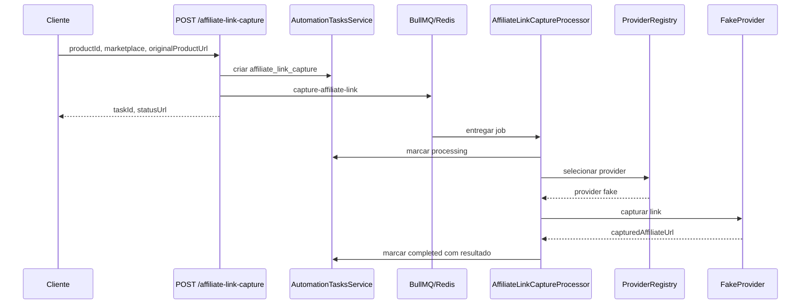

## Epic

[Marketplace Module](../epic.md)

## Parent

Referencia ao plano de marketplaces em `Docs/v2/marktplaces-modules.md`.

## What to build

Criar o modulo `affiliate-link-capture` com contrato de provider, provider fake, registry, controller, service e processor para capturar link afiliado de forma assincrona por task.

## Acceptance criteria

- [x] `POST /affiliate-link-capture` aceita `productId`, `marketplace` e `originalProductUrl`.
- [x] A request cria uma `AutomationTask` do tipo `affiliate_link_capture` e enfileira job `capture-affiliate-link`.
- [x] O processor chama o provider fake e marca a task como `completed` com `capturedAffiliateUrl`.
- [x] Erros manuais previstos sao mapeados para `manual_required`.
- [x] A resposta inicial contem `taskId` e `statusUrl`.
- [x] Ha testes cobrindo criacao do job e processamento de sucesso.
- [x] A secao `Result` documenta o comportamento entregue, Diagrama Mermaid caso aplicavel, os principais arquivos ou contratos, Responsabilidade de cada arquivo, explicações sobre conceitos (caso aplicavel e necessario), decisoes e limites relevantes e as validacoes executadas.

## Result

Foi criado o feature module `affiliate-link-capture`, isolado do modulo de
busca de produtos e integrado ao `AutomationTasksModule`. O endpoint valida a
entrada, cria uma task persistida e publica o processamento na fila BullMQ
`affiliate-link-capture` sem executar o provider durante a request HTTP.

### Contratos e responsabilidades

- `affiliate-link-capture.controller.ts`: expoe `POST /affiliate-link-capture`
  e delega a orquestracao ao service.
- `capture-affiliate-link.dto.ts`: valida UUID do produto, marketplace e URL
  HTTP/HTTPS com limite de tamanho.
- `affiliate-link-capture.service.ts`: cria a `AutomationTask`, publica o job e
  monta `taskId` e `statusUrl`.
- `affiliate-link-capture.job.ts`: centraliza nomes da fila/job e os contratos
  tipados de payload e resultado.
- `affiliate-link-capture-provider.interface.ts`: define o contrato pequeno de
  captura e o token de injecao dos providers.
- `fake-affiliate-link-capture.provider.ts`: gera uma URL deterministica no
  dominio fake para todos os marketplaces conhecidos.
- `affiliate-link-capture-provider.registry.ts`: indexa providers por
  marketplace e rejeita registros duplicados.
- `affiliate-link-capture.processor.ts`: executa o provider em background e
  persiste as transicoes `processing`, `completed`, `manual_required` ou
  `failed`.
- `affiliate-link-capture-manual-required.error.ts`: erro de dominio usado por
  providers para encerrar o job sem retry quando e necessaria acao humana.

### Decisoes e limites

O registry recebe providers por um token de injecao, evitando depender de
implementacoes concretas e permitindo que as tasks 009 e 010 substituam o fake
por providers reais. Registros duplicados falham durante a inicializacao para
impedir selecao ambigua.

Erros manuais previstos (`captcha_required`, `session_invalid`,
`layout_changed` ou `manual_required`) devem ser representados por
`AffiliateLinkCaptureManualRequiredError`. Eles atualizam a task e encerram o
job sem retry. Erros inesperados marcam a task como `failed/internal_error` e
sao relancados para o BullMQ aplicar as tentativas configuradas.

O provider entregue nesta task e deliberadamente fake: ele nao acessa uma
conta de afiliado nem valida o produto no marketplace. Captura real, browser e
sessao autenticada continuam pertencendo as tasks 008, 009 e 010.

Assim como no fluxo de busca existente, a task e criada antes de `queue.add()`.
Uma indisponibilidade do Redis pode deixar uma task `pending` sem job; uma
estrategia transacional/outbox permanece fora do escopo desta entrega.

### Validacao

- Testes novos: 9 testes aprovados em 4 suites.
- Suite completa: 40 testes aprovados em 14 suites.
- Build: `pnpm run build` aprovado.
- ESLint dos arquivos novos e do `AppModule`: aprovado.
- O lint global encontrou somente 15 erros de Prettier em arquivos gerados do
  Prisma, fora do escopo desta task.

## Blocked by

- `docs/marketplace-module/tasks/003-criar-persistencia-e-status-de-automation-task.md`
