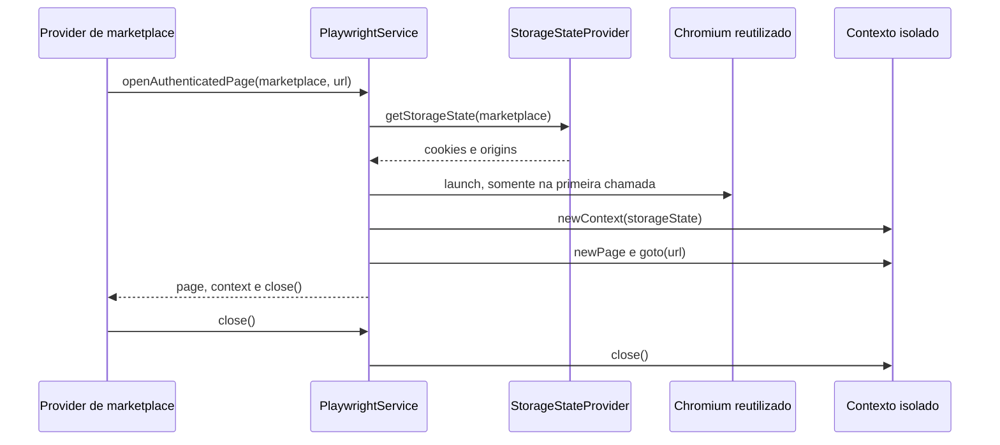

## Epic

[Marketplace Module](../epic.md)

## Parent

Referencia ao plano de marketplaces em `Docs/v2/marktplaces-modules.md`.

## What to build

Criar a infraestrutura de browser para automacoes autenticadas, com `PlaywrightService` capaz de abrir paginas por marketplace usando `storageState` carregado de uma fonte controlada.

## Acceptance criteria

- [x] Playwright esta instalado e encapsulado em um modulo de infra de browser.
- [x] `PlaywrightService` reutiliza browser, cria contextos isolados e fecha recursos no destroy do modulo.
- [x] Existe metodo para abrir pagina autenticada por marketplace com `storageState`.
- [x] A ausencia de credencial/sessao e tratada com erro explicito.
- [x] Ha testes ou mocks cobrindo criacao de pagina autenticada e encerramento do browser.
- [x] A secao `Result` documenta o comportamento entregue, Diagrama Mermaid caso aplicavel, os principais arquivos ou contratos, Responsabilidade de cada arquivo, explicações sobre conceitos (caso aplicavel e necessario), decisoes e limites relevantes e as validacoes executadas.

## Result

Foi criado o `BrowserModule` em `src/infra/browser`, com Playwright encapsulado
por contratos injetaveis. O modulo exporta somente o `PlaywrightService`; os
detalhes de launch do Chromium e de leitura das sessoes permanecem internos.



### Contratos e responsabilidades

- `browser.module.ts`: composition root que registra o Chromium, o provider de
  `storageState` e o `PlaywrightService`.
- `index.ts`: fachada publica usada pelos feature modules, sem expor detalhes
  internos de composicao.
- `playwright/`: ciclo de vida do browser, navegacao autenticada, tipos e token
  de injecao do launcher.
- `storage-state/`: abstracao e implementacao da fonte de sessao, variaveis por
  marketplace, erros explicitos e testes de leitura/validacao.

### Configuracao

Cada marketplace possui uma variavel com o caminho do arquivo gerado pelo
Playwright:

| Marketplace   | Variavel                           |
| ------------- | ---------------------------------- |
| Amazon        | `AMAZON_STORAGE_STATE_PATH`        |
| Mercado Livre | `MERCADO_LIVRE_STORAGE_STATE_PATH` |
| Shopee        | `SHOPEE_STORAGE_STATE_PATH`        |

Configuracoes opcionais:

| Variavel                           | Default | Finalidade                        |
| ---------------------------------- | ------- | --------------------------------- |
| `PLAYWRIGHT_HEADLESS`              | `true`  | Use `false` para browser visivel. |
| `PLAYWRIGHT_NAVIGATION_TIMEOUT_MS` | `30000` | Timeout padrao de navegacao.      |

Arquivos `*.storage-state.json` e o diretorio `.auth/` foram adicionados ao
`.gitignore` para reduzir o risco de versionar cookies e tokens. Os caminhos
sao lidos somente da configuracao do processo, nunca do payload HTTP.

### Uso pelos providers

O handle retornado deve ser fechado em `finally`, inclusive quando seletores ou
navegacao falharem:

```ts
const session = await playwrightService.openAuthenticatedPage(
  Marketplace.MercadoLivre,
  productUrl,
);

try {
  // Interagir com session.page.
} finally {
  await session.close();
}
```

O servico fecha automaticamente o contexto quando a criacao da pagina ou o
`goto` falha. Contextos esquecidos pelo consumidor tambem sao fechados no
`onModuleDestroy`, seguido pelo browser compartilhado. `main.ts` agora habilita
shutdown hooks para executar esse cleanup em `SIGTERM` e `SIGINT`.

### Decisoes e limites

Cada automacao recebe um novo `BrowserContext`, evitando compartilhar cookies
mutaveis, local storage ou paginas entre jobs concorrentes. A instancia do
Chromium e reutilizada para evitar o custo de um processo novo por job.

A infraestrutura valida somente a estrutura minima do `storageState`
(`cookies` e `origins`). Validade da sessao, CAPTCHA e mudancas de layout serao
tratados pelos providers reais nas tasks 009 e 010.

O pacote Playwright foi instalado, mas os binarios do Chromium nao foram
baixados nesta task. Cada ambiente que executar automacoes reais deve
provisiona-los com `pnpm exec playwright install chromium` ou usar uma imagem
que ja os contenha.

### Validacao

- 9 testes novos aprovados em 2 suites, com browser e contextos mockados.
- Suite completa: 49 testes aprovados em 16 suites.
- `pnpm run build` aprovado.
- ESLint dos arquivos de browser, `AppModule` e `main.ts` aprovado.

## Blocked by

- `docs/marketplace-module/tasks/007-adicionar-captura-de-link-afiliado-como-fluxo-assincrono.md`
