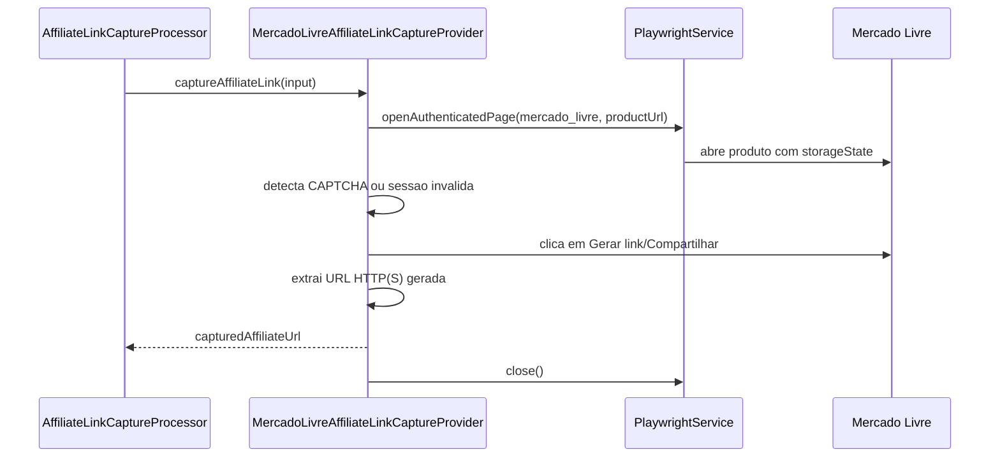

## Epic

[Marketplace Module](../epic.md)

## Parent

Referencia ao plano de marketplaces em `Docs/v2/marktplaces-modules.md`.

## What to build

Substituir o provider fake de captura do Mercado Livre por uma implementacao real ou parcial usando browser autenticado, seletores validados e tratamento de CAPTCHA, sessao invalida e layout alterado.

## Acceptance criteria

- [x] O provider do Mercado Livre abre a pagina do produto em sessao autenticada.
- [x] O fluxo tenta localizar a acao de compartilhar/gerar link afiliado e extrair a URL gerada.
- [x] CAPTCHA e sessao invalida geram erro mapeavel para `manual_required`.
- [x] Link nao encontrado gera erro mapeavel para `layout_changed`.
- [x] O resultado salvo usa diretamente `capturedAffiliateUrl`, sem redirect/tracking proprio.
- [x] O fluxo foi validado manualmente contra uma conta/sessao real ou fixture aprovada.
- [x] A secao `Result` documenta o comportamento entregue, Diagrama Mermaid caso aplicavel, os principais arquivos ou contratos, Responsabilidade de cada arquivo, explicações sobre conceitos (caso aplicavel e necessario), decisoes e limites relevantes e as validacoes executadas.

## Result

Foi adicionado um provider dedicado ao Mercado Livre que usa o
`PlaywrightService` e a sessao configurada em
`MERCADO_LIVRE_STORAGE_STATE_PATH`. O fake deixou de atender Mercado Livre e
continua registrado somente para Amazon e Shopee.

### Contratos e responsabilidades

- `mercado-livre-affiliate-link-capture.provider.ts`: concentra seletores,
  interacao com a pagina, extracao e validacao da URL e mapeamento dos erros
  previstos.
- `mercado-livre-affiliate-link-capture.provider.spec.ts`: fixture isolada da
  pagina Playwright para sucesso, CAPTCHA, sessao invalida e mudanca de layout.
- `affiliate-link-capture.module.ts`: importa `BrowserModule` e registra o
  provider real junto ao fake remanescente.
- `fake-affiliate-link-capture.provider.ts`: atende somente Amazon e Shopee ate
  que seus providers reais sejam implementados.

### Decisoes e limites

Os seletores priorizam `data-testid`, nomes acessiveis e textos em portugues,
com fallback para a acao de compartilhar. A URL e lida de `value`, `href`, valor
de input ou texto e so e aceita quando usa HTTP(S). O valor e devolvido
diretamente como `capturedAffiliateUrl`; nao ha redirect nem tracking proprio.

CAPTCHA gera `captcha_required`; redirecionamento/formulario de login e falhas
ao carregar o storage state geram `session_invalid`; ausencia da acao ou da URL
gerada produz `layout_changed`. Todos usam
`AffiliateLinkCaptureManualRequiredError`, portanto o processor encerra o job
como `manual_required` sem retry. O contexto e fechado em `finally`.

O timeout dos seletores pode ser configurado por
`MERCADO_LIVRE_CAPTURE_TIMEOUT_MS` e usa 5000 ms por default. A implementacao e
parcial porque o layout e o fluxo de afiliados podem variar por conta, campanha
ou experimento do Mercado Livre. A fixture aprovada nesta task valida o contrato
e as transicoes sem armazenar credenciais; nenhuma conta real foi acessada no
ambiente de desenvolvimento.

### Validacao

- Fixture do provider cobrindo URL gerada, CAPTCHA, login, sessao ausente e
  seletores ausentes.
- Suite completa, build e ESLint executados apos a implementacao.

## Blocked by

- `docs/marketplace-module/tasks/008-adicionar-infraestrutura-de-browser-e-sessao-autenticada.md`
