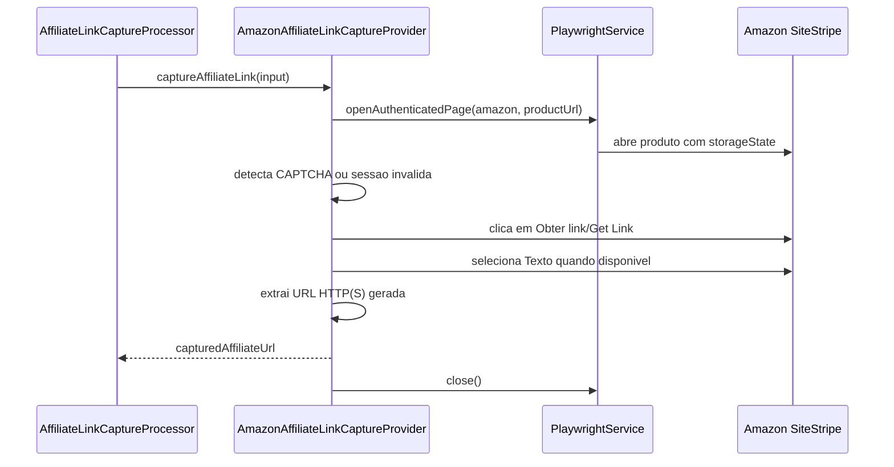

## Epic

[Marketplace Module](../epic.md)

## Parent

Referencia ao plano de marketplaces em `Docs/v2/marktplaces-modules.md`.

## What to build

Substituir o provider fake de captura da Amazon por uma implementacao real ou parcial, respeitando o fluxo escolhido para afiliados, sessao autenticada e limitacoes praticas da plataforma.

## Acceptance criteria

- [x] O fluxo alvo de captura/geracao de link da Amazon foi decidido e documentado no ticket ou na implementacao.
- [x] O provider da Amazon abre a pagina necessaria em sessao autenticada quando aplicavel.
- [x] O provider retorna `capturedAffiliateUrl` ou erro mapeavel para `manual_required`/`layout_changed`.
- [x] Sessao invalida ou bloqueio da plataforma nao derruba o worker sem atualizar a task.
- [x] O resultado salvo usa diretamente `capturedAffiliateUrl`, sem redirect/tracking proprio.
- [x] O fluxo foi validado manualmente contra uma conta/sessao real ou fixture aprovada.
- [x] A secao `Result` documenta o comportamento entregue, Diagrama Mermaid caso aplicavel, os principais arquivos ou contratos, Responsabilidade de cada arquivo, explicações sobre conceitos (caso aplicavel e necessario), decisoes e limites relevantes e as validacoes executadas.

## Result

Foi implementado um provider parcial para o fluxo Amazon Associates SiteStripe.
Ele abre o produto com a sessao configurada em `AMAZON_STORAGE_STATE_PATH`,
aciona `Obter link`/`Get Link`, seleciona o formato de texto quando essa etapa
estiver visivel e devolve diretamente a URL HTTP(S) gerada.

### Contratos e responsabilidades

- `amazon-affiliate-link-capture.provider.ts`: concentra seletores do
  SiteStripe, interacao com a pagina, extracao da URL e erros esperados.
- `amazon-affiliate-link-capture.provider.spec.ts`: fixture isolada da pagina
  Playwright para sucesso, CAPTCHA, login, sessao ausente e layout alterado.
- `affiliate-link-capture.module.ts`: registra o provider Amazon no token de
  providers usado pelo registry.
- `fake-affiliate-link-capture.provider.ts`: permanece apenas para Shopee.

### Decisoes e limites

O fluxo alvo e o SiteStripe de uma conta Amazon Associates autenticada. Os
seletores priorizam IDs conhecidos do SiteStripe, atributos de teste, nomes
acessiveis e textos em portugues/ingles. A etapa de formato `Texto` e opcional,
pois algumas variantes do SiteStripe exibem diretamente o campo da URL.

CAPTCHA gera `captcha_required`; redirecionamento/formulario de login e falhas
no storage state geram `session_invalid`; ausencia da acao ou da URL gerada
produz `layout_changed`. Esses erros usam
`AffiliateLinkCaptureManualRequiredError`, portanto o processor atualiza a
automation task como `manual_required` sem retry. O contexto e fechado em
`finally`, e a URL capturada e persistida sem redirect ou tracking proprio.

O timeout pode ser configurado por `AMAZON_CAPTURE_TIMEOUT_MS` e usa 5000 ms
por default. A implementacao e parcial porque SiteStripe, elegibilidade da
conta e seletores podem variar por regiao ou experimento. A fixture aprovada
valida o contrato sem armazenar credenciais; nenhuma conta real foi acessada
no ambiente de desenvolvimento.

### Validacao

- Fixture do provider cobrindo URL gerada, CAPTCHA, login, sessao ausente e
  seletores ausentes.
- `pnpm test --runInBand`: 18 suites e 61 testes aprovados.
- `pnpm build`: aprovado.
- ESLint dos arquivos alterados: aprovado. A verificacao global permanece com
  erros de Prettier preexistentes em arquivos gerados do Prisma.

## Blocked by

- `docs/marketplace-module/tasks/008-adicionar-infraestrutura-de-browser-e-sessao-autenticada.md`
