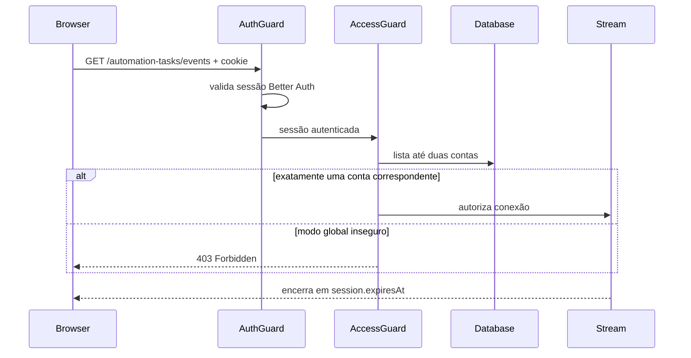

## Parent

Especificação definida na conversa sobre a integração SSE do fluxo de descoberta de produtos.

## What to build

Definir e documentar como `GET /automation-tasks/events` será autenticado com Better Auth e como cada conexão receberá somente eventos de tasks acessíveis ao usuário atual. A decisão deve considerar que o guard global está desabilitado e que as tasks ainda não possuem ownership explícito.

## Acceptance criteria

- [ ] A estratégia de autenticação da rota SSE está documentada, incluindo guard, leitura da sessão e resposta para sessão ausente ou expirada.
- [ ] Está definido se o primeiro incremento exige ownership persistido das tasks ou se operará como stream global autenticado em ambiente de usuário único.
- [ ] A regra de autorização e filtragem dos eventos é verificável e não permite vazamento silencioso entre usuários quando houver múltiplas contas.
- [ ] As consequências para CORS, cookies, `withCredentials` e expiração da sessão estão documentadas.
- [ ] A seção `Result` documenta o comportamento entregue, Diagrama Mermaid caso aplicável, os principais arquivos ou contratos, Responsabilidade de cada arquivo, explicações sobre conceitos (caso aplicável e necessário), decisões e limites relevantes e as validações executadas.

## Blocked by

None - can start immediately.

## Result

### Comportamento entregue

- `GET /automation-tasks/events` aplica `AuthGuard` explicitamente, pois `disableGlobalAuthGuard` permanece habilitado.
- O guard do Better Auth lê a sessão a partir dos headers/cookies e responde `401 Unauthorized` quando a sessão está ausente, inválida ou expirada.
- Após autenticar, `AutomationTaskEventsAccessGuard` autoriza o stream global somente quando existe exatamente uma conta no banco e ela corresponde ao `session.user.id`.
- Se houver zero contas, mais de uma conta ou divergência de usuário, a conexão recebe `403 Forbidden`. A política é fail-closed e impede que o stream global passe a vazar tasks silenciosamente quando uma segunda conta for criada.
- A conexão é encerrada no `session.expiresAt`. A reconexão indicada pelo SSE executa novamente o guard e recebe `401` caso a sessão não tenha sido renovada.

### Decisões e limites

- Este incremento não adiciona ownership a `AutomationTask`. Ele opera como stream global autenticado somente no ambiente de usuário único já adotado pelo projeto.
- Antes de suportar múltiplas contas, `AutomationTask` deve ganhar ownership persistido e tanto a autorização quanto o canal/evento Redis devem ser filtrados por esse ownership.
- A política consulta no máximo duas contas na abertura da conexão. Não há consulta por heartbeat ou evento.
- O browser deve abrir o stream na origem configurada por `FRONTEND_URL`. O backend já usa CORS com `credentials: true` e origem explícita.
- Em cross-origin, o cliente deve usar `new EventSource(url, { withCredentials: true })`; em same-origin, os cookies são enviados normalmente. A configuração do cookie Better Auth (`Secure`, `SameSite` e domínio) também precisa permitir o cenário de implantação.
- O token de sessão continua em cookie HttpOnly; ele não é colocado em query string nem no payload SSE.

### Fluxo

### Principais arquivos

- `automation-task-events-access.guard.ts`: aplica a regra de autorização fail-closed.
- `automation-task-events-access.service.ts`: verifica a quantidade de contas e a identidade da sessão via Prisma.
- `automation-task-events.controller.ts`: declara os guards e encerra o stream na expiração.
- `main.ts`: mantém CORS com origem explícita e credenciais.

### Validações

- Testes do guard cobrem usuário único autorizado e ambiente com múltiplas contas bloqueado.
- Teste do controller cobre encerramento no `session.expiresAt`.
- `pnpm test --runInBand`: 34 suites e 127 testes aprovados na validação final.
- `pnpm build`: compilação NestJS aprovada.
