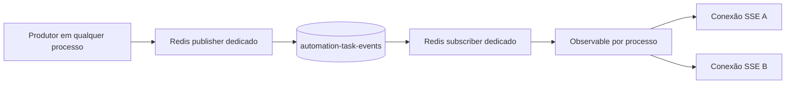

## Parent

Especificação definida na conversa sobre a integração SSE do fluxo de descoberta de produtos.

## What to build

Entregar `GET /automation-tasks/events` como stream SSE autenticado e global por sessão, distribuído entre processos por Redis Pub/Sub. A conexão deve emitir eventos tipados, heartbeat, orientação de retry e liberar todos os recursos quando o cliente desconectar.

## Acceptance criteria

- [ ] `GET /automation-tasks/events` responde com `text/event-stream`, aplica a autenticação definida no ticket 001 e mantém a conexão aberta.
- [ ] O módulo possui publisher e subscriber Redis dedicados, configurados por `REDIS_HOST` e `REDIS_PORT`, sem reutilizar conexão bloqueante do BullMQ.
- [ ] O stream encaminha `task.created` e `task.updated` com `id` SSE único e payload contendo `eventId`, `eventType`, `taskId`, `type`, `status`, `marketplace` e `updatedAt`.
- [ ] O servidor envia heartbeat aproximadamente a cada 15 segundos e informa retry inicial de 3 segundos sem representar heartbeat como evento de domínio.
- [ ] Desconexão do cliente remove intervalos e subscriptions e não mantém listeners ou recursos Redis órfãos.
- [ ] A seção `Result` documenta o comportamento entregue, Diagrama Mermaid caso aplicável, os principais arquivos ou contratos, Responsabilidade de cada arquivo, explicações sobre conceitos (caso aplicável e necessário), decisões e limites relevantes e as validações executadas.

## Blocked by

- `docs/tickets/001-definir-autenticacao-e-isolamento-do-stream-sse.md`

## Result

### Comportamento entregue

- `GET /automation-tasks/events` responde `text/event-stream`, mantém a conexão aberta e aplica os guards definidos no ticket 001.
- A resposta inicial envia `retry: 3000`; a cada aproximadamente 15 segundos envia `: heartbeat`, um comentário SSE que não é confundido com evento de domínio.
- Eventos `task.created` e `task.updated` são enviados com `id`, `event` e `data`. O payload contém `eventId`, `eventType`, `taskId`, `type`, `status`, `marketplace` e `updatedAt`.
- O publisher gera um UUID por publicação e normaliza `updatedAt` para ISO 8601, garantindo IDs SSE distintos sob o contrato público.
- O módulo cria dois clientes `ioredis` dedicados a partir de `REDIS_HOST` e `REDIS_PORT`: um publisher e um subscriber. Nenhuma conexão BullMQ é reutilizada.
- O subscriber Redis assina `automation-task-events` uma vez por processo e distribui eventos validados por `Observable`. Cada conexão SSE possui sua própria subscription RxJS.
- No disconnect ou na expiração da sessão, heartbeat, timeout e subscription RxJS são removidos. No shutdown do módulo, listener, subscription Redis e os dois clientes Redis são encerrados.

### Fluxo

### Principais arquivos e responsabilidades

- `automation-task-events.controller.ts`: framing SSE, retry, heartbeat, expiração e cleanup por conexão.
- `automation-task-events.publisher.ts`: contrato público para publicar `eventType + task`.
- `automation-task-events.subscriber.ts`: contratos e tipos dos eventos de domínio.
- `redis-automation-task-events.publisher.ts`: gera `eventId` e publica JSON no Redis.
- `redis-automation-task-events.subscriber.ts`: gerencia subscription Redis, valida payloads e distribui eventos.
- `redis-pub-sub-client.ts`: tokens DI, interface mínima do cliente e nome do canal.
- `automation-tasks.module.ts`: cria os clientes dedicados e exporta `AutomationTaskEventsPublisher`.

### Decisões e limites

- Redis Pub/Sub não oferece replay. `Last-Event-ID` não recupera eventos perdidos durante desconexão; o cliente deve reconciliar o estado atual pela consulta da task.
- O subscriber compartilhado evita uma conexão Redis por browser. Desconectar um browser remove somente sua subscription local; a subscription Redis permanece enquanto o processo estiver ativo e é encerrada no shutdown.
- Payloads Redis malformados ou fora do contrato são descartados com warning e não chegam aos clientes.
- A publicação nos pontos de criação e transição das tasks pertence aos tickets 003 e 004; este ticket entrega o publisher exportado e o transporte completo.

### Validações

- Testes cobrem framing SSE, retry, evento tipado, heartbeat, disconnect, expiração de sessão, geração de IDs distintos, publicação, subscription e shutdown Redis.
- `pnpm test --runInBand`: 34 suites e 127 testes aprovados na validação final.
- `pnpm exec eslint "{src,test}/**/*.ts"`: sem erros; permanece um warning preexistente em `marketplace-product-provider.registry.spec.ts`.
- `pnpm build`: compilação NestJS aprovada.
