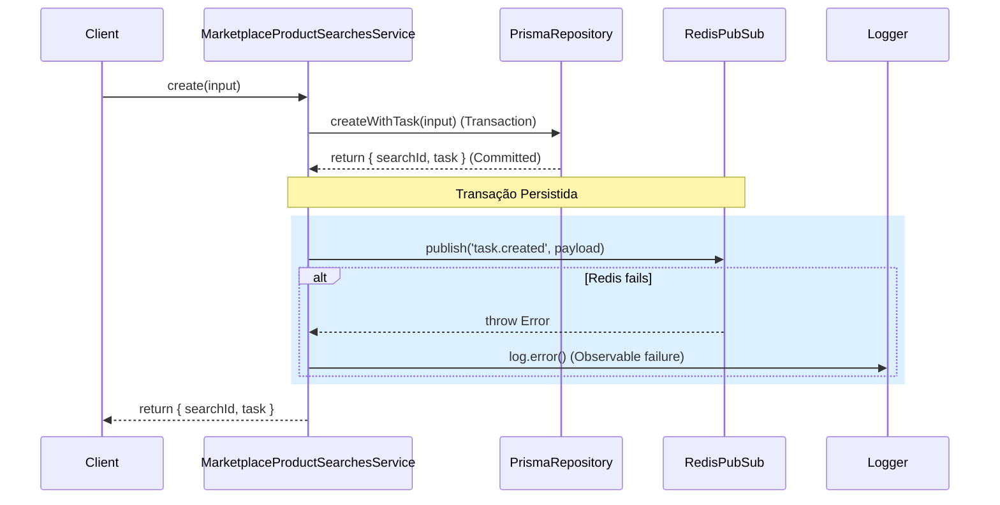

## Parent

Especificação definida na conversa sobre a integração SSE do fluxo de descoberta de produtos.

## What to build

Publicar notificações `task.created` e `task.updated` para todo o ciclo de vida de uma busca de marketplace. Cada evento deve ser publicado somente após a persistência correspondente e incluir o `searchId` necessário para o frontend reconciliar resumo e produtos.

## Acceptance criteria

- [x] A criação transacional de task e busca publica `task.created` somente depois do commit, com `taskId`, `searchId`, tipo, status, marketplace e timestamp persistido.
- [x] As transições para `processing`, `completed`, `partial`, `failed` e `manual_required` publicam `task.updated` após o repositório confirmar a atualização.
- [x] Eventos terminais representam o estado já consultável por `GET /automation-tasks/:id` e `GET /marketplace-searches/:searchId`.
- [x] Falha de publicação não faz rollback de uma transição já persistida, mas é registrada de forma observável para diagnóstico e reconciliação REST.
- [x] Os testes demonstram que nenhuma notificação é publicada antes da persistência ou quando a task não existe.
- [x] A seção `Result` documenta o comportamento entregue, Diagrama Mermaid caso aplicável, os principais arquivos ou contratos, Responsabilidade de cada arquivo, explicações sobre conceitos (caso aplicável e necessário), decisões e limites relevantes e as validações executadas.

## Blocked by

- `docs/tickets/002-expor-stream-sse-de-automacoes-via-redis.md`

## Result

### Comportamento Entregue
Implementação da publicação de eventos `task.created` (na criação transacional da busca de marketplace) e `task.updated` (durante as transições do ciclo de vida da tarefa). Os eventos contêm o `searchId` para possibilitar a reconciliação no frontend e são publicados de forma assíncrona após a devida persistência no banco de dados. Qualquer falha na publicação em rede/Redis é capturada e logada silenciosamente, não revertendo a transação do banco de dados (resiliência).

### Fluxo de Eventos

### Principais Arquivos e Responsabilidades

1. **[automation-task-events.publisher.ts](file:///home/luis/Documentos/Git/lead_magnet/lead-magnet-back/src/modules/automation-tasks/events/interfaces/automation-task-events.publisher.ts)**
   - Define o contrato da interface de publicação e adiciona o campo `searchId` ao payload `PublishableAutomationTask`.
2. **[automation-task-events.subscriber.ts](file:///home/luis/Documentos/Git/lead_magnet/lead-magnet-back/src/modules/automation-tasks/events/interfaces/automation-task-events.subscriber.ts)**
   - Contrato da interface de subscrição, adicionando `searchId` opcional ao `AutomationTaskDomainEvent`.
3. **[redis-automation-task-events.publisher.ts](file:///home/luis/Documentos/Git/lead_magnet/lead-magnet-back/src/modules/automation-tasks/events/redis/redis-automation-task-events.publisher.ts)**
   - Implementação do publicador Redis, mapeando o `searchId` para o payload JSON publicado no canal Redis.
4. **[marketplace-product-searches.service.ts](file:///home/luis/Documentos/Git/lead_magnet/lead-magnet-back/src/modules/marketplaces/searches/marketplace-product-searches.service.ts)**
   - Serviço responsável pela criação transacional de busca e publicação de `task.created` pós-commit.
5. **[automation-tasks.service.ts](file:///home/luis/Documentos/Git/lead_magnet/lead-magnet-back/src/modules/automation-tasks/automation-tasks.service.ts)**
   - Serviço responsável pelo ciclo de vida das tarefas e pela publicação de `task.updated` pós-persistência.

### Validações Executadas
Foram criadas suítes de testes unitários que garantem a segurança do fluxo:
- **[marketplace-product-searches.service.spec.ts](file:///home/luis/Documentos/Git/lead_magnet/lead-magnet-back/src/modules/marketplaces/searches/marketplace-product-searches.service.spec.ts)**: Testa a criação com sucesso e a publicação do evento `task.created` com todos os atributos necessários, bem como a tolerância a falhas do Redis (não fazendo rollback).
- **[automation-tasks.service.spec.ts](file:///home/luis/Documentos/Git/lead_magnet/lead-magnet-back/src/modules/automation-tasks/automation-tasks.service.spec.ts)**: Testa transições para `processing`, `completed`, etc., garantindo a publicação de `task.updated` com `searchId` para buscas de marketplace, a não publicação para outras tarefas, e que falhas do publicador não quebram a transição de estado da tarefa.
