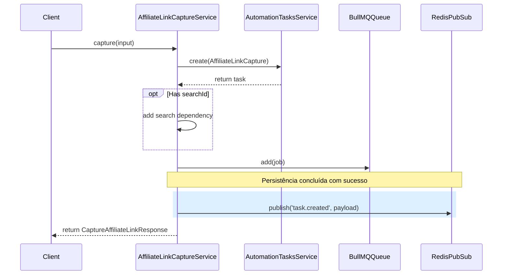

## Parent

Especificação definida na conversa sobre a integração SSE do fluxo de descoberta de produtos.

## What to build

Publicar notificações `task.created` e `task.updated` para capturas de link afiliado, preservando a origem relacional da busca e do produto. O evento deve carregar `searchId` e `productId` quando disponíveis para atualizar a coleção correta no frontend.

## Acceptance criteria

- [x] `task.created` é publicado somente depois da task, dependência com a busca e enfileiramento da captura estarem concluídos com sucesso.
- [x] O evento de criação inclui `searchId` quando a captura nasceu de uma busca e inclui o `productId` informado no comando.
- [x] As transições para `processing`, `completed`, `failed` e `manual_required` publicam `task.updated` após persistência e preservam os identificadores de domínio disponíveis.
- [x] Capturas sem origem de busca continuam produzindo eventos válidos sem inventar `searchId`.
- [x] Os testes cobrem captura com busca, captura independente, estados terminais e ausência de publicação para operações rejeitadas.
- [x] A seção `Result` documenta o comportamento entregue, Diagrama Mermaid caso aplicável, os principais arquivos ou contratos, Responsabilidade de cada arquivo, explicações sobre conceitos (caso aplicável e necessário), decisões e limites relevantes e as validações executadas.

## Blocked by

- `docs/tickets/002-expor-stream-sse-de-automacoes-via-redis.md`

## Result

### Comportamento Entregue
Implementação da publicação de eventos `task.created` e `task.updated` para capturas de link afiliado. O evento preserva e propaga a origem relacional (`searchId` e `productId` do produto de destino) quando disponíveis. Capturas independentes (sem busca de origem) geram eventos válidos sem o campo `searchId`. As falhas de publicação no Redis Pub/Sub são registradas de forma segura (logs) sem forçar o rollback das operações de persistência e transição de estado da tarefa.

### Fluxo de Eventos

### Resolução de Identificadores de Domínio em `task.updated`
Para garantir a integridade dos dados durante transições de estado (onde o registro de resultados `AffiliateLinkCaptureResult` pode ainda não existir), a resolução dos identificadores funciona da seguinte forma:
- **`searchId`**: Resolvido através da busca pelas dependências da tarefa (`successorLinks`), obtendo a relação `predecessor.marketplaceSearch.id` se aplicável.
- **`productId`**: Resolvido a partir de `attemptsHistory` (acessando a propriedade `productId` passada no `metadata` ao iniciar a tentativa de execução via `markProcessing`) ou, se já concluído, através da relação direta `affiliateLinkCapture.sourceProductId`.

### Principais Arquivos e Responsabilidades

1. **[affiliate-link-capture.service.ts](file:///home/luis/Documentos/Git/lead_magnet/lead-magnet-back/src/modules/affiliate-link-capture/affiliate-link-capture.service.ts)**
   - Gerencia a orquestração de criação de tarefas de captura, dependências, enfileiramento e publicação do evento `task.created`.
2. **[affiliate-link-capture.processor.ts](file:///home/luis/Documentos/Git/lead_magnet/lead-magnet-back/src/modules/affiliate-link-capture/jobs/affiliate-link-capture.processor.ts)**
   - Processador BullMQ que passa o `productId` no `metadata` ao chamar `markProcessing`.
3. **[automation-tasks.service.ts](file:///home/luis/Documentos/Git/lead_magnet/lead-magnet-back/src/modules/automation-tasks/automation-tasks.service.ts)**
   - Publica o evento `task.updated` em transições de tarefas de captura, extraindo corretamente os identificadores de busca e produto.
4. **[prisma-automation-tasks.repository.ts](file:///home/luis/Documentos/Git/lead_magnet/lead-magnet-back/src/modules/automation-tasks/prisma-automation-tasks.repository.ts)**
   - Carrega de forma otimizada os dados relacionais de predecessores necessários para resolver o `searchId`.

### Validações Executadas
Foram implementados testes unitários adicionais:
- **[affiliate-link-capture.service.spec.ts](file:///home/luis/Documentos/Git/lead_magnet/lead-magnet-back/src/modules/affiliate-link-capture/affiliate-link-capture.service.spec.ts)**: Valida a publicação de `task.created` com `searchId` e `productId` para capturas vinculadas, a omissão de `searchId` para capturas independentes, e que falhas do publicador não bloqueiam a operação de captura.
- **[automation-tasks.service.spec.ts](file:///home/luis/Documentos/Git/lead_magnet/lead-magnet-back/src/modules/automation-tasks/automation-tasks.service.spec.ts)**: Valida a publicação correta de `task.updated` para tarefas de captura afiliada durante transições (`markProcessing` e `markCompleted`), cobrindo a extração do `productId` a partir de metadados de tentativas e o tratamento resiliente de erros do publicador.
