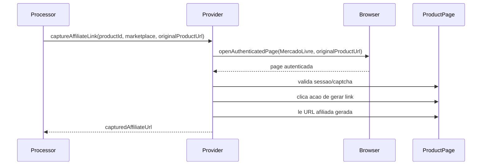

## Parent

Referencia ao PRD `docs/features/mercado-livre-affiliate-link-capture/prd.md`.

## What to build

Entregar o caminho principal de captura no provider do Mercado Livre: receber `originalProductUrl`, abrir a pagina do produto com sessao autenticada, acionar a geracao de link afiliado, ler a URL gerada e retornar `capturedAffiliateUrl` para o processor sem mover seletores ou regras de UI para a camada de orquestracao.

## Acceptance criteria

- [x] O provider do Mercado Livre abre a pagina usando `originalProductUrl` em sessao autenticada do marketplace.
- [x] O provider aciona o controle de geracao de link afiliado da pagina do produto usando seletores reais e fallbacks razoaveis.
- [x] O provider le o link gerado de input, textarea, href, texto visivel ou superficie equivalente.
- [x] O link retornado e validado como URL HTTP(S) antes de sair do provider.
- [x] O browser context e fechado em sucesso e em falha.
- [x] Testes unitarios demonstram o happy path com `capturedAffiliateUrl` retornado ao contrato do provider.
- [x] A secao `Result` documenta o comportamento entregue, Diagrama Mermaid caso aplicavel, os principais arquivos ou contratos, Responsabilidade de cada arquivo, explicacoes sobre conceitos caso necessario, decisoes e limites relevantes e as validacoes executadas.

## Blocked by

None - can start immediately.

## Result

### Comportamento entregue

O provider de captura afiliada do Mercado Livre continua recebendo `productId`, `marketplace` e `originalProductUrl` pelo contrato publico `captureAffiliateLink`. A navegacao autenticada usa `originalProductUrl`, mantendo `productId` apenas como identificador interno para rastreio do job e persistencia feita pelo processor.

Depois de abrir a pagina do produto, o provider valida bloqueios conhecidos, localiza a acao de gerar link afiliado, clica no controle e procura uma URL gerada na superficie de captura. A URL e lida de `value`, `href`, `inputValue` ou texto visivel e so e retornada quando possui protocolo HTTP(S).

### Fluxo

### Principais arquivos e responsabilidades

- `mercado-livre-affiliate-link-capture.provider.ts`: encapsula a automacao Playwright do Mercado Livre e retorna somente `{ capturedAffiliateUrl }`.
- `mercado-livre-affiliate-link-capture.provider.spec.ts`: cobre o comportamento publico do provider com Playwright mockado como fronteira externa.

### Decisoes e limites

- A regra de UI permanece no provider, nao no processor.
- A leitura da URL gerada e defensiva, mas ainda depende de seletores da UI externa do Mercado Livre.
- O ticket nao implementa validacao real com conta autenticada; isso permanece no ticket HITL posterior.

### Validacoes

- `npm test -- --runInBand src/modules/affiliate-link-capture/providers/mercado-livre-affiliate-link-capture.provider.spec.ts`
- `npm test -- --runInBand src/modules/affiliate-link-capture src/modules/marketplaces/providers/mercado-livre/mercado-livre-product.provider.spec.ts`
- `npx eslint src/modules/affiliate-link-capture/providers/mercado-livre-affiliate-link-capture.provider.ts src/modules/affiliate-link-capture/providers/mercado-livre-affiliate-link-capture.provider.spec.ts src/modules/marketplaces/providers/mercado-livre/mercado-livre-product.provider.spec.ts`
- `npm run build`
