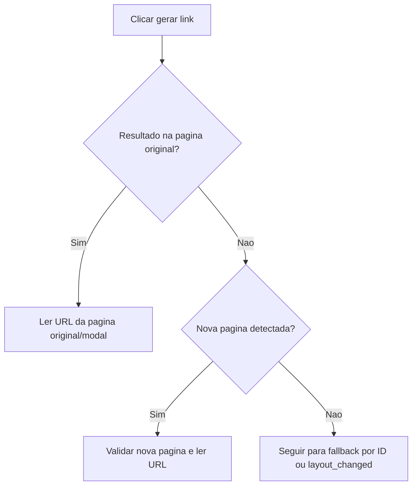

## Parent

Referencia ao PRD `docs/features/mercado-livre-affiliate-link-capture/prd.md`.

## What to build

Expandir a captura do Mercado Livre para continuar corretamente quando a acao de geracao abrir modal, popup ou nova pagina. A fatia deve manter a decisao de contexto dentro do provider e preservar o contrato simples `captureAffiliateLink`.

## Acceptance criteria

- [x] Quando a geracao permanece na mesma pagina, o provider continua lendo o resultado da pagina original.
- [x] Quando a geracao abre popup ou nova aba, o provider detecta a nova pagina e passa a interagir com ela.
- [x] Quando a geracao abre modal, o provider interage com a superficie modal sem trocar indevidamente de pagina.
- [x] O provider fecha os contextos/paginas gerenciados sem vazamento de recurso.
- [x] Testes unitarios cobrem os caminhos mesma pagina, popup/nova pagina e modal.
- [x] A secao `Result` documenta o comportamento entregue, Diagrama Mermaid caso aplicavel, os principais arquivos ou contratos, Responsabilidade de cada arquivo, explicacoes sobre conceitos caso necessario, decisoes e limites relevantes e as validacoes executadas.

## Blocked by

- `docs/features/mercado-livre-affiliate-link-capture/tickets/001-capturar-link-afiliado-mercado-livre-pela-pagina-do-produto.md`

## Result

### Comportamento entregue

O provider inicia a escuta de uma possivel nova pagina antes de clicar na acao de geracao. Apos o clique, ele tenta primeiro ler o resultado na pagina original. Isso cobre o fluxo em mesma pagina e modais, ja que o modal permanece acessivel pela mesma instancia de `Page`.

Quando o resultado nao aparece na pagina original e o contexto emite uma nova pagina, o provider valida a nova pagina e passa a procurar a URL gerada nela. A espera por popup usa timeout curto para nao atrasar o caminho comum de mesma pagina.

### Fluxo

### Principais arquivos e responsabilidades

- `mercado-livre-affiliate-link-capture.provider.ts`: decide a superficie ativa de captura sem expor essa complexidade ao processor.
- `mercado-livre-affiliate-link-capture.provider.spec.ts`: cobre happy path em mesma pagina e nova pagina.

### Decisoes e limites

- Modais sao tratados como fluxo de mesma pagina, porque continuam acessiveis pelo mesmo `Page`.
- Popups/nova aba sao tratados por `BrowserContext.waitForEvent('page')`.
- O provider tenta a pagina original primeiro para evitar atraso desnecessario no fluxo comum.

### Validacoes

- `npm test -- --runInBand src/modules/affiliate-link-capture/providers/mercado-livre-affiliate-link-capture.provider.spec.ts`
- `npm test -- --runInBand src/modules/affiliate-link-capture src/modules/marketplaces/providers/mercado-livre/mercado-livre-product.provider.spec.ts`
- `npx eslint src/modules/affiliate-link-capture/providers/mercado-livre-affiliate-link-capture.provider.ts src/modules/affiliate-link-capture/providers/mercado-livre-affiliate-link-capture.provider.spec.ts src/modules/marketplaces/providers/mercado-livre/mercado-livre-product.provider.spec.ts`
- `npm run build`
