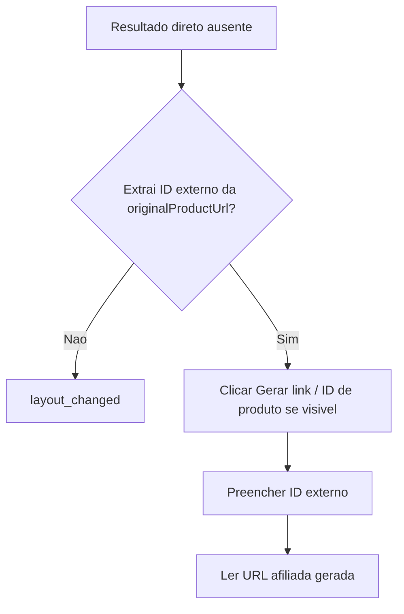

## Parent

Referencia ao PRD `docs/features/mercado-livre-affiliate-link-capture/prd.md`.

## What to build

Entregar fallback para o caminho "Gerar link / ID de produto" quando a interface do Mercado Livre exigir ou oferecer essa opcao. O provider deve derivar o ID externo do Mercado Livre a partir de `originalProductUrl`, preencher o fluxo exigido e retornar o link gerado validado.

## Acceptance criteria

- [x] O provider consegue extrair um ID externo Mercado Livre a partir de URLs de produto suportadas.
- [x] O provider usa `originalProductUrl` como fonte principal e so usa o ID externo como fallback de UI.
- [x] O fallback seleciona ou aciona o caminho "Gerar link / ID de produto" quando apresentado pela interface.
- [x] Se nenhum ID externo puder ser derivado quando ele for obrigatorio, a task falha de forma tipada e observavel.
- [x] Testes cobrem URL com ID direto, URL com ID em parametro/hash e URL sem ID aproveitavel.
- [x] A secao `Result` documenta o comportamento entregue, Diagrama Mermaid caso aplicavel, os principais arquivos ou contratos, Responsabilidade de cada arquivo, explicacoes sobre conceitos caso necessario, decisoes e limites relevantes e as validacoes executadas.

## Blocked by

- `docs/features/mercado-livre-affiliate-link-capture/tickets/001-capturar-link-afiliado-mercado-livre-pela-pagina-do-produto.md`

## Result

### Comportamento entregue

Quando a URL afiliada nao aparece apos o clique principal, o provider tenta o fallback por ID de produto. Ele deriva o ID externo do Mercado Livre a partir de `originalProductUrl`, aciona o modo "Gerar link / ID de produto" quando visivel, preenche o campo de ID e tenta ler novamente a URL gerada.

Se a URL original nao contem ID aproveitavel, o provider nao inventa identificador. O fluxo permanece sem resultado gerado e termina como `layout_changed`, preservando a falha tipada esperada pelo processor.

### Fluxo

### Principais arquivos e responsabilidades

- `mercado-livre-affiliate-link-capture.provider.ts`: executa o fallback por ID somente quando o resultado direto nao aparece.
- `mercado-livre-product-parser.utils.ts`: fornece a extracao de ID externo do Mercado Livre a partir de URLs conhecidas.
- `mercado-livre-affiliate-link-capture.provider.spec.ts`: cobre fallback por ID e falha sem ID aproveitavel.
- `mercado-livre-product.provider.spec.ts`: cobre extracao de ID em URL direta, parametro `wid`, hash e URL sem ID.

### Decisoes e limites

- `originalProductUrl` continua sendo a entrada principal do provider.
- O ID externo e usado apenas como fallback de UI, nao substitui o `productId` interno.
- O ticket nao adiciona novos campos de DTO para texto sugerido, canal ou tracking.

### Validacoes

- `npm test -- --runInBand src/modules/affiliate-link-capture/providers/mercado-livre-affiliate-link-capture.provider.spec.ts`
- `npm test -- --runInBand src/modules/affiliate-link-capture/providers/mercado-livre-affiliate-link-capture.provider.spec.ts src/modules/marketplaces/providers/mercado-livre/mercado-livre-product.provider.spec.ts`
- `npm test -- --runInBand src/modules/affiliate-link-capture src/modules/marketplaces/providers/mercado-livre/mercado-livre-product.provider.spec.ts`
- `npx eslint src/modules/affiliate-link-capture/providers/mercado-livre-affiliate-link-capture.provider.ts src/modules/affiliate-link-capture/providers/mercado-livre-affiliate-link-capture.provider.spec.ts src/modules/marketplaces/providers/mercado-livre/mercado-livre-product.provider.spec.ts`
- `npm run build`
