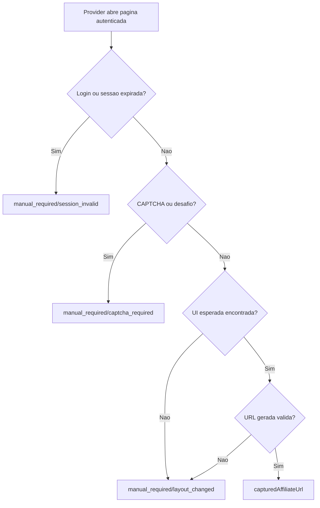

## Parent

Referencia ao PRD `docs/features/mercado-livre-affiliate-link-capture/prd.md`.

## What to build

Fortalecer o provider do Mercado Livre para mapear bloqueios conhecidos da automacao para erros manuais tipados: sessao invalida, CAPTCHA, layout alterado, output ausente, URL gerada invalida e timeout configuravel. O resultado deve ser uma task `manual_required` para bloqueios conhecidos e erro tecnico apenas para falhas inesperadas.

## Acceptance criteria

- [x] Redirecionamento para login ou formulario de autenticacao gera erro manual com tipo de sessao invalida.
- [x] CAPTCHA ou desafio anti-automacao gera erro manual com tipo de CAPTCHA.
- [x] Ausencia de controles essenciais de geracao ou resultado gera erro manual com tipo de layout alterado.
- [x] URL gerada vazia, invalida ou nao HTTP(S) nao e persistida como captura concluida.
- [x] Timeout de captura continua configuravel por variavel existente ou padrao local do provider.
- [x] Testes cobrem cada bloqueio conhecido e confirmam fechamento da sessao.
- [x] A secao `Result` documenta o comportamento entregue, Diagrama Mermaid caso aplicavel, os principais arquivos ou contratos, Responsabilidade de cada arquivo, explicacoes sobre conceitos caso necessario, decisoes e limites relevantes e as validacoes executadas.

## Blocked by

- `docs/features/mercado-livre-affiliate-link-capture/tickets/001-capturar-link-afiliado-mercado-livre-pela-pagina-do-produto.md`

## Result

### Comportamento entregue

O provider do Mercado Livre mapeia bloqueios conhecidos para `AffiliateLinkCaptureManualRequiredError` com `AutomationErrorType` especifico. Redirecionamentos para login e textos de login do Mercado Livre viram `session_invalid`; CAPTCHA visivel ou texto generico de desafio anti-automacao vira `captcha_required`; ausencia de acao, ausencia de resultado ou URL gerada invalida vira `layout_changed`.

O tempo de espera da captura continua vindo de `MERCADO_LIVRE_CAPTURE_TIMEOUT_MS`, com fallback para o timeout padrao do provider. Os testes verificam que o timeout configurado e usado ao aguardar a UI do Mercado Livre.

### Fluxo

### Principais arquivos e responsabilidades

- `mercado-livre-affiliate-link-capture.provider.ts`: detecta bloqueios conhecidos, aplica timeout configuravel e retorna erro manual tipado.
- `mercado-livre-affiliate-link-capture.provider.spec.ts`: cobre sessao invalida por URL e texto, CAPTCHA por seletor e texto, layout alterado, URL invalida, timeout configurado e fechamento da sessao.

### Decisoes e limites

- Bloqueios conhecidos nao sao tratados como erro tecnico anonimo; o processor os recebe como erro manual e marca a task como `manual_required`.
- O provider nao tenta resolver CAPTCHA nem renovar sessao.
- A validacao real contra UI externa permanece no ticket HITL.

### Validacoes

- `npm test -- --runInBand src/modules/affiliate-link-capture/providers/mercado-livre-affiliate-link-capture.provider.spec.ts`
- `npm test -- --runInBand src/modules/affiliate-link-capture src/modules/marketplaces/providers/mercado-livre/mercado-livre-product.provider.spec.ts`
- `npx eslint src/modules/affiliate-link-capture/providers/mercado-livre-affiliate-link-capture.provider.ts src/modules/affiliate-link-capture/providers/mercado-livre-affiliate-link-capture.provider.spec.ts src/modules/affiliate-link-capture/jobs/affiliate-link-capture.processor.spec.ts src/modules/marketplaces/providers/mercado-livre/mercado-livre-product.provider.spec.ts`
- `npm run build`
