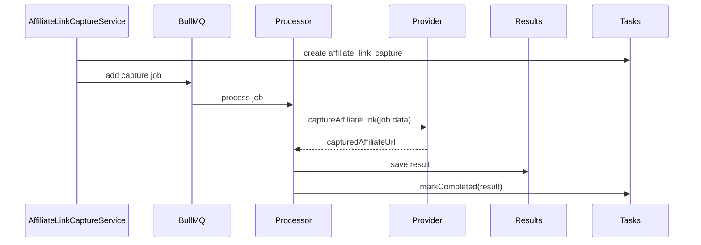

## Parent

Referencia ao PRD `docs/features/mercado-livre-affiliate-link-capture/prd.md`.

## What to build

Garantir que a captura Mercado Livre continue integrada ao fluxo assincrono existente: service cria task e job, processor resolve provider e monta o resultado, resultado e persistido, eventos/status continuam consultaveis e nenhuma regra de UI do Mercado Livre vaza para o processor.

## Acceptance criteria

- [x] O service continua enfileirando `productId`, `marketplace` e `originalProductUrl` para capturas afiliadas.
- [x] O processor continua chamando o provider e montando resultado com `productId`, `marketplace`, `originalProductUrl` e `capturedAffiliateUrl`.
- [x] O processor nao contem seletores Playwright nem regras especificas de UI do Mercado Livre.
- [x] O resultado persistido permanece disponivel pelos fluxos existentes de task/status e consultas relacionadas a busca.
- [x] Erros manuais do provider continuam sendo mapeados para `manual_required`.
- [x] Testes de service, processor e persistencia cobrem o contrato observavel sem depender de browser real.
- [x] A secao `Result` documenta o comportamento entregue, Diagrama Mermaid caso aplicavel, os principais arquivos ou contratos, Responsabilidade de cada arquivo, explicacoes sobre conceitos caso necessario, decisoes e limites relevantes e as validacoes executadas.

## Blocked by

- `docs/features/mercado-livre-affiliate-link-capture/tickets/001-capturar-link-afiliado-mercado-livre-pela-pagina-do-produto.md`

## Result

### Comportamento entregue

O contrato assincrono de captura afiliada foi preservado. O service continua criando a task, relacionando busca de origem quando enviada, enfileirando `productId`, `marketplace` e `originalProductUrl`, e publicando evento de criacao sem depender da automacao Playwright.

O processor continua marketplace-agnostico: marca a task como `processing`, resolve o provider pelo registry, passa os dados do job para `captureAffiliateLink`, salva o resultado, marca a task como `completed` e retorna o objeto com `productId`, `marketplace`, `originalProductUrl` e `capturedAffiliateUrl`. Erros manuais do provider seguem para `markManualRequired`.

### Fluxo

### Principais arquivos e responsabilidades

- `affiliate-link-capture.service.ts`: cria task, dependencia opcional, job e evento de criacao.
- `affiliate-link-capture.processor.ts`: orquestra status, provider, persistencia e resultado sem regras de UI.
- `affiliate-link-capture.processor.spec.ts`: cobre contrato de resultado para Mercado Livre e mapeamento de erro manual.
- `affiliate-link-capture.service.spec.ts`: cobre payload enfileirado e eventos de criacao.
- `prisma-affiliate-link-capture-results.repository.ts`: mantem persistencia do resultado de captura.

### Decisoes e limites

- Nenhuma regra de seletor ou Playwright foi movida para o processor.
- Nenhuma mudanca de schema ou DTO foi necessaria.
- A validacao real com conta Mercado Livre permanece separada por ser HITL.

### Validacoes

- `npm test -- --runInBand src/modules/affiliate-link-capture/jobs/affiliate-link-capture.processor.spec.ts`
- `npm test -- --runInBand src/modules/affiliate-link-capture src/modules/marketplaces/providers/mercado-livre/mercado-livre-product.provider.spec.ts`
- `npx eslint src/modules/affiliate-link-capture/providers/mercado-livre-affiliate-link-capture.provider.ts src/modules/affiliate-link-capture/providers/mercado-livre-affiliate-link-capture.provider.spec.ts src/modules/affiliate-link-capture/jobs/affiliate-link-capture.processor.spec.ts src/modules/marketplaces/providers/mercado-livre/mercado-livre-product.provider.spec.ts`
- `npm run build`
