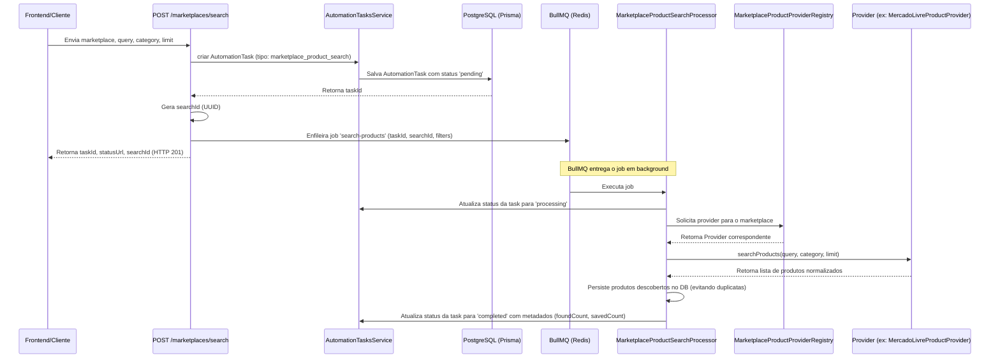
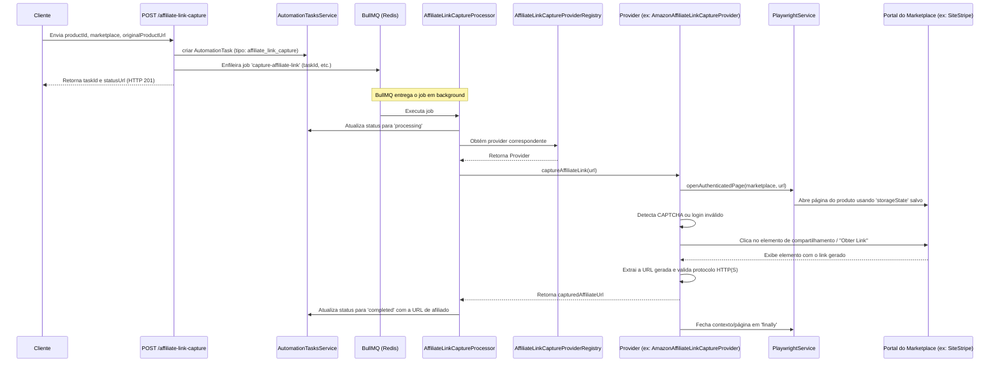
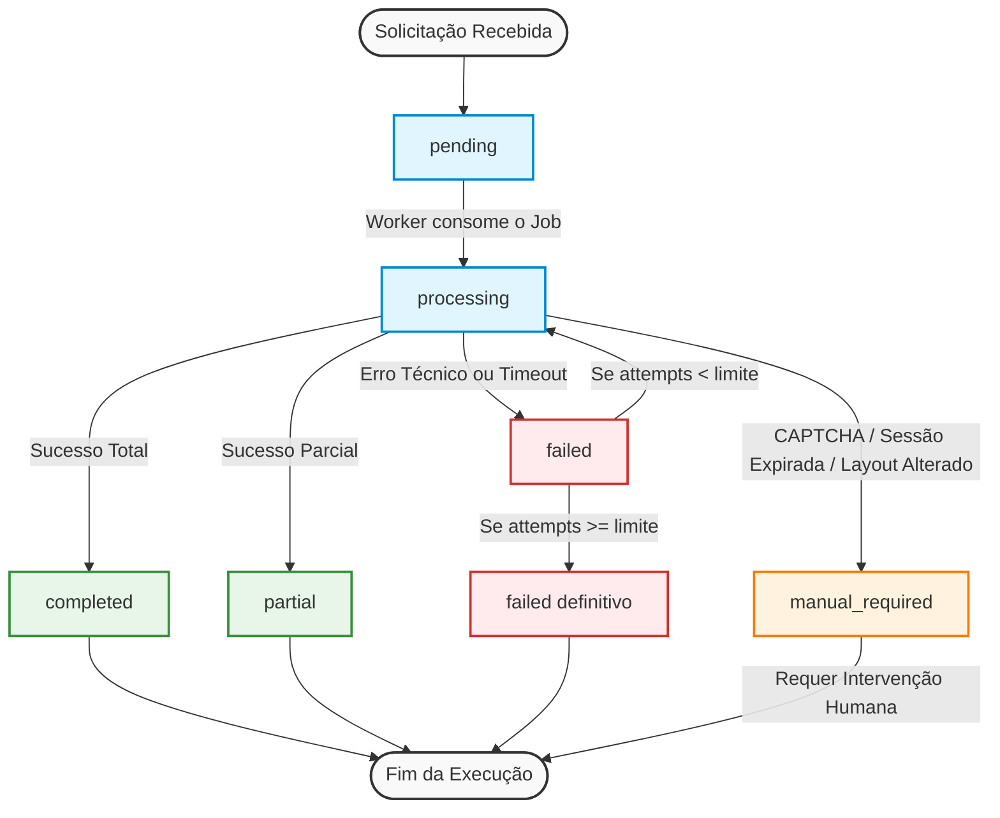

# Documentação Técnica: Módulo de Marketplaces (Marketplace Module)

Este documento centraliza e descreve a arquitetura, fluxos, componentes e decisões técnicas do **Módulo de Marketplaces** do backend do Lead Magnet. 

O módulo foi estruturado para suportar a busca assíncrona de produtos por meio de múltiplos provedores e a captura de links afiliados de forma automatizada, utilizando filas de processamento assíncrono e controle de navegadores headless.

---

## 1. Visão Geral e Arquitetura

O módulo de marketplaces é composto por dois fluxos de negócio principais:
1. **Busca de Produtos (`marketplace_product_search`)**: Busca produtos em marketplaces a partir de filtros (termo de busca, categoria, limite), normaliza os dados e os persiste.
2. **Captura de Links Afiliados (`affiliate_link_capture`)**: Acessa o marketplace em uma sessão autenticada do usuário (afiliado), simula as ações de geração de link no painel da plataforma e extrai a URL final com comissão.

Ambos os fluxos operam de maneira **assíncrona** por meio do **BullMQ** com persistência de status através da entidade `AutomationTask`.

---

## 2. Diagramas de Sequência

### Fluxo de Busca de Produtos (Assíncrono)

O fluxo de busca desacopla a requisição HTTP da execução do scraper ou consulta do provider:



---

### Fluxo de Captura de Link Afiliado

O fluxo de captura utiliza o **Playwright** para simular ações em portais logados de afiliados:



---

## 3. Estados da Automação (`AutomationTask`)

A entidade `AutomationTask` controla o ciclo de vida das operações assíncronas do backend. O fluxo de estados e transições é representado abaixo:



Seus estados são mapeados da seguinte forma:

*   **`pending`**: A tarefa foi criada no banco de dados e adicionada na fila de processamento, mas o worker ainda não a iniciou.
*   **`processing`**: O worker iniciou o processamento do job. O contador de tentativas (`attempts`) é incrementado neste momento.
*   **`completed`**: A tarefa terminou com sucesso. O resultado (ex: contagem de produtos ou URL capturada) é salvo no campo `result`.
*   **`partial`**: Reservado para execuções parciais (ex: encontrou produtos, mas com alguns erros tratáveis).
*   **`failed`**: Ocorreu um erro técnico recuperável (ex: timeout de rede, erro interno). O erro é registrado em `error` e `errorType` (ex: `timeout`, `internal_error`), e o job é recolocado na fila se restarem tentativas configuradas no BullMQ.
*   **`manual_required`**: Um bloqueio conhecido ocorreu e requer intervenção humana imediata (ex: CAPTCHA detectado, sessão inválida ou expirada, layout alterado). **O job é abortado imediatamente sem tentativas de re-execução** para evitar detecção de comportamento robótico e bloqueio de contas.

---

## 4. Persistência de Dados e Deduplicação

Para evitar a duplicação desnecessária de registros de produtos no banco de dados, o schema do Prisma divide as entidades em:

1.  **`MarketplaceProduct`**: Tabela canônica que armazena os detalhes dos produtos descobertos. 
    *   **Identificador Único**: Chave composta única em `[marketplace, originalUrl]`.
    *   Se um produto já existir no banco, seus dados (preço, título, etc.) são atualizados (`upsert`).
2.  **`MarketplaceProductSearchResult`**: Tabela de relacionamento de descobertas.
    *   Vincula um `searchId` (execução da busca) a um `productId` (`MarketplaceProduct`).
    *   **Identificador Único**: Chave composta única em `[searchId, productId]`.
    *   Isso garante idempotência de reprocessamento (um mesmo job reexecutado não gera novas linhas de vínculo).

### Métricas de Resultados
*   **`foundCount`**: Quantidade total de produtos retornados pelo provider (pode incluir itens já conhecidos).
*   **`savedCount`**: Quantidade de novos produtos vinculados àquela busca pela primeira vez.

---

## 5. Configuração do Ambiente e Variáveis

### Configuração do BullMQ / Redis
| Variável | Valor Padrão | Descrição |
| :--- | :--- | :--- |
| `REDIS_HOST` | `localhost` | Host da instância Redis. |
| `REDIS_PORT` | `6379` | Porta da instância Redis. |

**Parâmetros Padrão do BullMQ**:
*   `attempts`: `3` (Três tentativas antes de falhar de forma definitiva).
*   `backoff`: `exponential` com delay base de `5000ms`.
*   `removeOnComplete`: `100` (Mantém as 100 tarefas concluídas mais recentes na fila).
*   `removeOnFail`: `500` (Mantém as 500 tarefas com falhas mais recentes).

### Configuração do Playwright e Sessão
| Variável | Valor Padrão | Descrição |
| :--- | :--- | :--- |
| `PLAYWRIGHT_HEADLESS` | `true` | Determina se o navegador rodará oculto (`true`) ou visível (`false`). |
| `PLAYWRIGHT_NAVIGATION_TIMEOUT_MS` | `30000` | Tempo limite para navegação do Playwright. |
| `AMAZON_STORAGE_STATE_PATH` | *Nenhum* | Caminho absoluto para o arquivo JSON de cookies de sessão da Amazon. |
| `MERCADO_LIVRE_STORAGE_STATE_PATH` | *Nenhum* | Caminho absoluto para o JSON de cookies de sessão do Mercado Livre. |
| `SHOPEE_STORAGE_STATE_PATH` | *Nenhum* | Caminho absoluto para o JSON de cookies de sessão da Shopee. |

> [!WARNING]
> Arquivos de sessão contêm tokens e cookies ativos. Eles foram adicionados ao `.gitignore` (`*.storage-state.json` e `.auth/`) e **nunca** devem ser versionados.

---

## 6. Provedores e Cobertura (Registry)

Os providers são selecionados dinamicamente via padrões de **Registry** injetáveis (evitando acoplamento rígido).

### Matriz de Provedores Implementados
| Marketplace | Provedor de Busca (`searchProducts`) | Provedor de Captura (`captureAffiliateLink`) |
| :--- | :--- | :--- |
| **Mercado Livre** | Fake (Simulado) | Real/Parcial (Playwright: Clique em Compartilhar e extração) |
| **Amazon** | Fake (Simulado) | Real/Parcial (Playwright: SiteStripe / Get Link) |
| **Shopee** | *Não Implementado / Retorna Erro* | Fake (Gera link determinístico simulado) |

### Fluxo de Recuperação no Provider Real (Playwright)
Quando um erro é disparado durante o fluxo do Playwright, ele é capturado e traduzido para um tipo de erro de negócio:
*   `CAPTCHA_REQUIRED` -> Marcar task como `manual_required` com erro `captcha_required`.
*   `ETIMEDOUT` / Timeout -> Marcar task como `failed` com erro `timeout`.
*   Login redirecionado ou cookies inválidos -> Marcar task como `manual_required` com erro `session_invalid`.
*   Seletor de botão de afiliado ausente após timeout -> Marcar task como `manual_required` com erro `layout_changed`.

---

## 7. Instruções para Desenvolvimento e Testes

### Executando os Testes do Módulo
Para rodar os testes unitários e de integração de maneira isolada e garantir que nenhum comportamento foi quebrado:

```bash
# Executa todos os testes unitários em sequência
pnpm test --runInBand

# Executa testes em modo watch para desenvolvimento local
pnpm test:watch
```

### Provisionando o Navegador Playwright
Antes de executar os fluxos em desenvolvimento ou homologação que façam chamadas reais aos providers do Mercado Livre e Amazon, certifique-se de que os binários do Chromium estão instalados:

```bash
pnpm exec playwright install chromium
```
